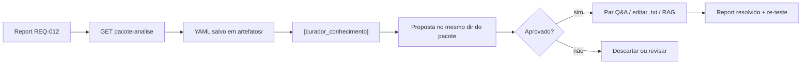

# Guia operacional — Evolução da base de conhecimento

<!-- CLASSIFICACAO: PROCESSO -->

Público: **desenvolvedor** (Beto) e **curador de conteúdo** (quem mantém Q&A e documentos de produto).

Este guia descreve o fluxo técnico para tratar respostas inadequadas do agente via `[curador_conhecimento]`, sem envolver operação da Rita.

---

## Visão geral



---

## Passo 1 — Obter o report

Origens típicas:

- Reprovação de mensagem no painel (REQ-011 → REQ-012.2)
- Report manual em detalhe do processamento (REQ-012.3)
- Bug de QA (`artefatos/qa/bugs/`)

Anote o **`report_id`** (ex.: `42`).

---

## Passo 2 — Gerar o pacote de análise

Com o backend rodando:

```powershell
# YAML (default) — salvar no diretório de curadoria do colaborador
curl -s "http://localhost:8000/api/reports/42/pacote-analise" -o AnotacoesPessoais\Beto\Curadoria\report_042_pacote_analise.yaml

# JSON (debug)
curl -s "http://localhost:8000/api/reports/42/pacote-analise?formato=json"
```

Parâmetros opcionais:

| Query | Default | Descrição |
|-------|---------|-----------|
| `antes` | 5 | Mensagens antes da pergunta na janela |
| `depois` | 3 | Mensagens depois |
| `formato` | yaml | `yaml` ou `json` |

### O que o pacote contém

| Seção | Conteúdo |
|-------|----------|
| `report` | Descrição, categoria, status |
| `par_problema` | Pergunta do cliente + resposta inadequada |
| `processamento_original` | Auditoria do momento (intenção, template, trechos RAG) |
| `conversa` | Janela de mensagens + infos do atendimento |
| `reprocessamento.classificacao_atual` | Classificador reexecutado hoje |
| `reprocessamento.diagnostico_busca` | Top-10 Q&A e RAG **sem** filtro de score + hits de produção |
| `documentos_fonte_sugeridos` | Arquivos em `docs/FoldersProdutos/` com preview |
| `hipoteses_automaticas` | Regras simples (score abaixo do limiar, fallback, etc.) |

**Importante:** Reports antigos já **resolvidos** podem ser reprocessados — o pacote reflete o estado **atual** da base. Serve para validar se a correção aplicada funcionaria hoje.

---

## Passo 3 — Ler hipóteses e documentos sugeridos

Ordem sugerida de leitura do YAML:

1. `par_problema` — o que o cliente perguntou e o que saiu errado
2. `hipoteses_automaticas` — ponto de partida
3. `reprocessamento.diagnostico_busca` — compare `qa_top_candidatos` vs `qa_hit_producao`
4. `documentos_fonte_sugeridos` — leia `preview` e abra o arquivo completo se necessário

### Seleção de documentos (3 camadas)

1. **Trechos RAG** do diagnóstico → `metadata.arquivo` em `docs/FoldersProdutos/`
2. **Entidades** (`tipos_produto` do classificador) → mapeamento para arquivos canônicos
3. **Overlap de tokens** da pergunta com nomes de arquivo do inventário RAG

---

## Passo 4 — Invocar o agente curador

No Cursor:

```
[curador_conhecimento] analise AnotacoesPessoais/Beto/Curadoria/report_042_pacote_analise.yaml e gere proposta
```

O agente deve produzir a proposta **no mesmo diretório do pacote** — ex.: `AnotacoesPessoais/Beto/Curadoria/report_042_proposta.md` (C06). Fallback sem pacote em disco: `artefatos/curador_conhecimento/propostas/`.

Tipos de ação na proposta:

| Tipo | Quando | Quem aplica |
|------|--------|-------------|
| `criar_par_qa` | Pergunta recorrente, resposta estável | Curador no painel Base Q&A |
| `enriquecer_documento` | Info existe mas RAG não acha / falta segmento-porte | Editar `.txt` + re-ingestão |
| `ajustar_parametro` | Conteúdo existe, score logo abaixo do limiar | Dev via REQ-014 |
| `escalar_humano` | Caso consultivo, não é gap de FAQ | Operação / REQ-004 |

---

## Passo 5 — Aplicar correção aprovada

### Par Q&A

1. Painel → Base de Q&A → criar rascunho (ou fluxo de reprovação RT-002)
2. Aprovar par
3. Reenviar pergunta similar em conversa de teste

### Documento fonte

1. Editar `docs/FoldersProdutos/<arquivo>.txt`
2. Reprocessar pipeline RAG (ver `docs/comandos_uteis.md` — seção RAG)
3. Reexecutar pacote-analise no mesmo report

### Parâmetros

Ajustar via `GET/PATCH /api/config/rag` ou tabela `parametros` — documentar na resolução do report.

---

## Passo 6 — Fechar o report

1. PATCH `/api/reports/{id}` → `status: resolvido`, `resolucao: "..."` 
2. Anotar link à proposta e ao par Q&A / commit
3. Opcional: cenário de regressão em QA

---

## Roteamento por categoria do report

| Categoria | Agente |
|-----------|--------|
| `resposta_inadequada`, `template` | `[curador_conhecimento]` |
| `classificacao` | `[ia_expert]` |
| `fluxo`, `dados`, `llm` | `[implementador]` |

O campo `meta.agente_sugerido` no pacote indica isso automaticamente.

---

## Referências

- REQ-012 — Reports de problema
- REQ-013 — Pares Q&A curados
- REQ-003 — RAG
- `agentes/curador_conhecimento.md` — identidade do agente
- `artefatos/curador_conhecimento/diretrizes.md` — C01–C06
