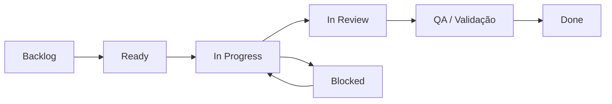
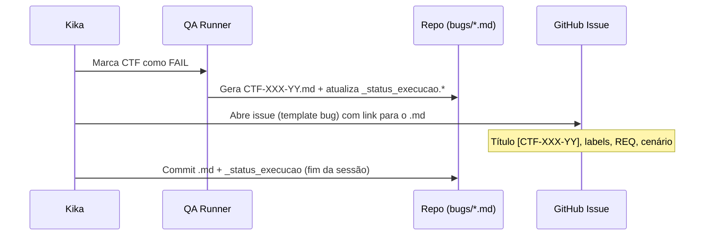

# Proposta: GitHub Projects para planejamento e acompanhamento

<!-- CLASSIFICACAO: HISTORICO -->
<!-- CLASSIFICACAO: ANDAMENTO -->

**Versão:** 0.2  
**Data:** 2026-06-08  
**Autor:** Beto (`[gerente]`)  
**Revisar com:** Kika  
**Status:** ✅ Aprovada em 08/06/2026 (D1–D4 fechadas; D5 fica para sprint futura)  

---

## 1. Objetivo

Introduzir **GitHub Projects** como quadro operacional do time (planejamento, execução e acompanhamento), **sem substituir** os artefatos já versionados no repositório.

| Ferramenta | Papel |
|------------|-------|
| **GitHub Projects** | Kanban vivo: quem faz o quê, em que estágio, nesta sprint |
| **`artefatos/requisitos_formais/`** | Fonte da verdade dos **REQ-XXX** |
| **`artefatos/qa/bugs/*.md`** | Fonte da verdade das **evidências** de bug (prints, passos, contexto) |
| **`artefatos/qa/bugs/_status_execucao.*`** | Snapshot da execução dos **CTF-XXX** (QA Runner) |
| **`artefatos/gerente_de_projetos/sprint_*_*.yaml`** | Fonte da verdade do **Sprint Review** (G01) |

**Princípio:** GitHub Issues = **rastreabilidade e workflow**; arquivos no repo = **conteúdo rico e histórico**.

---

## 2. Situação atual (baseline)

- **Cadência:** sprint de 14 dias (diretriz G02).
- **Requisitos:** 16 REQs formais (`REQ-001` … `REQ-016`).
- **Testes:** plano funcional Sprint 02 com 62 cenários `CTF-XXX-YY` (`cenarios_teste_funcionais_sprint02.md`).
- **Bugs abertos (2026-06-08):** 5 cenários em `FAIL` com arquivos `.md` na pasta `artefatos/qa/bugs/`:

| ID do bug | Cenário | REQs relacionados |
|-----------|---------|-------------------|
| `CTF-001-03-01` | Reuso de empresa já consultada | REQ-001.7, REQ-002.10 |
| `CTF-002-03-01` | Quantidade e tipo de produto extraídos | REQ-002.2, REQ-002.3 |
| `CTF-002-04-01` | E-mail extraído | REQ-002.2 |
| `CTF-003-03-01` | Par Q&A precede base documental | REQ-003, REQ-013 |
| `CTF-010-02-01` | Detalhe da conversa (painel) | REQ-010.7 |

- **Branches:** `feature/REQ-XXX-desc`, `bugfix/<descricao-curta>` (`politica_branches.md`); ID do bug/cenário vai na mensagem de commit, não no nome da branch (D2).
- **Time:** Beto (dev/arquitetura), Kika (QA), Rita (stakeholder — fora do board operacional).

---

## 3. Proposta de organização

### 3.1 Um projeto, várias visões

**Nome sugerido:** `Assistente de Vendas — Board`  
**Tipo:** GitHub Project (v2, tabela/board) vinculado ao repositório.

| Visão | Filtro / layout | Quem usa |
|-------|-----------------|----------|
| **Board** | Colunas por status (kanban) | Beto + Kika (dia a dia) |
| **Sprint atual** | Milestone = sprint corrente | Planning / daily |
| **Bugs ativos** | Label `tipo:bug` + status ≠ Done | Kika + Beto |
| **Por REQ** | Agrupar por campo `REQ` | Gerente / priorização |
| **Backlog** | Status = Backlog, sem sprint | Planning |

Não criar projetos separados para bugs e features no POC — evita duplicar campos e perder visão integrada.

### 3.2 Tipos de item (GitHub Issues)

Todo trabalho rastreável vira **Issue**. PRs referenciam issues (`Closes #42`).

| Tipo | Label | Quando usar | Exemplo de título |
|------|-------|-------------|-------------------|
| **Bug** | `tipo:bug` | Falha em cenário de teste ou produção | `[CTF-002-03-01] Q&A não usado na extração de produto` |
| **Feature / Story** | `tipo:feature` | Entrega de REQ ou parte dele | `[REQ-008] Webhook Twilio em produção` |
| **Task** | `tipo:task` | Trabalho técnico sem REQ novo | `Migrar cloudflared para serviço Windows` |
| **Chore** | `tipo:chore` | Processo, docs, tooling | `Atualizar comandos_uteis.md` |
| **Spike** | `tipo:spike` | Investigação com prazo curto | `Spike: comparar Neon vs Postgres local` |

**Issue templates** (3 arquivos em `.github/ISSUE_TEMPLATE/`): `bug.md`, `feature.md`, `task.md`.

### 3.3 Convenção de IDs (alinhar repo ↔ GitHub)

Hoje coexistem `CTF-XXX-YY` (bugs do QA Runner) e `BUG-XXX` (branches). Proposta:

| Artefato | ID canônico | Uso |
|----------|-------------|-----|
| Bug de teste | **`CTF-XXX-YY`** | Título da issue, nome do `.md`, mensagem de commit |
| Correção | **`#N`** (número da issue GitHub) | Referência em PR/commit |
| Requisito | **`REQ-XXX`** | Label + campo customizado |
| Cenário de teste | **`CTF-XXX-YY`** (cenário pai sem sufixo `-01`) | Campo `Cenário` na issue de bug |

**Branch de bugfix** — nome descritivo, sem ID (decisão D2). O ID do cenário/bug vai na mensagem de commit:

```
branch:  bugfix/extracao-produto
commit:  fix(CTF-002-03-01): corrige extracao de quantidade e tipo
```

> Atualizar `politica_branches.md` após aprovação desta proposta.

**Branch de feature (mantém):**

```
feature/REQ-008-integracao-twilio
```

> O número da issue (`#42`) entra no corpo do PR: `Closes #42`. Commits seguem `fix(CTF-002-03-01): ...` (D2).

### 3.4 Labels

**Tipo (obrigatório em toda issue):**

- `tipo:bug`, `tipo:feature`, `tipo:task`, `tipo:chore`, `tipo:spike`

**Prioridade (opcional, definida no triage):**

- `prio:critica`, `prio:alta`, `prio:media`, `prio:baixa`

**Área / camada:**

- `area:backend`, `area:frontend`, `area:rag`, `area:infra`, `area:qa`, `area:docs`

**REQ (uma label por issue principal; sub-itens podem repetir):**

- `REQ-001` … `REQ-016` (criar sob demanda ou só as ativas)

**Status de QA (só bugs):**

- `qa:reproduzido`, `qa:em-validacao`, `qa:aprovado`

### 3.5 Campos customizados do Project

| Campo | Tipo | Valores | Notas |
|-------|------|---------|-------|
| **Status** | Single select | Backlog → Ready → In Progress → In Review → QA → Done → Blocked | Colunas do board |
| **Sprint** | Iteration *ou* Milestone | Sprint 03, Sprint 04, … | Alinhar ao G02 (14 dias) |
| **Prioridade** | Single select | Crítica / Alta / Média / Baixa | Espelha labels |
| **REQ** | Texto | `REQ-002, REQ-003` | Rastreabilidade |
| **Cenário** | Texto | `CTF-002-03` | Só bugs |
| **Responsável** | Assignee | @Beto, @Kika | GitHub nativo |
| **Estimativa** | Single select | XS / S / M / L | Opcional no POC |

### 3.6 Fluxo de status (workflow)



| Status | Significado | Responsável típico |
|--------|-------------|-------------------|
| **Backlog** | Ideia registrada, sem prioridade | Gerente |
| **Ready** | Refinado, critério de aceite claro | Gerente + Kika |
| **In Progress** | Branch aberta, dev ativo | Beto |
| **In Review** | PR aberto | Beto |
| **QA / Validação** | Merge em `develop`, Kika retesta | Kika |
| **Done** | Aceito; cenário OK no QA Runner | Kika confirma |
| **Blocked** | Impedimento externo | Quem bloqueou |

**Regra:** issue só vai para **Done** quando Kika marcar o cenário como `OK` no QA Runner (ou N/A documentado).

### 3.7 Papéis no processo

| Papel | Ações no GitHub |
|-------|-----------------|
| **Kika** | Cria/atualiza issues de bug; move para QA; valida Done; comenta com resultado do CTF |
| **Beto** | Pega issues Ready; abre PR; move In Progress → In Review; corrige Blocked |
| **Gerente (Kika)** | Planning: prioriza backlog, define Sprint (milestone), fecha sprint no YAML |

Rita **não** precisa de acesso ao Project no POC; recebe Sprint Review (PPTX/YAML) como hoje.

---

## 4. Integração com artefatos existentes

### 4.1 Bug encontrado no QA Runner



**Corpo mínimo da issue de bug:**

```markdown
## Cenário
CTF-002-03 — Quantidade e tipo de produto extraídos

## Cobre
REQ-002.2, REQ-002.3, REQ-002.3A

## Evidência no repositório
artefatos/qa/bugs/CTF-002-03-01.md

## Severidade
(alta / média / baixa)

## Critério de fechamento
- [ ] CTF-002-03 marcado OK no QA Runner
- [ ] PR mergeado em develop
```

### 4.2 Feature / REQ

- Issue `tipo:feature` com link para `artefatos/requisitos_formais/REQ-XXX-....md`.
- Sub-tasks opcionais (checklist na issue ou issues filhas — **não** usar no POC se complicar).

### 4.3 Sprint Review (G01)

Ao **fechar sprint**:

1. Issues **Done** no milestone → alimentam lista `feito` do YAML.
2. Issues **Backlog/Ready** não concluídas → `backlogpendente` / `proximasprint`.
3. Issues **Blocked** → `bloqueios`.
4. Gerar YAML + PPTX como hoje (`gerente_de_projetos`).

GitHub Projects **complementa** o YAML; não substitui (stakeholders e cobertura de REQs continuam no artefato formal).

### 4.4 O que **não** migrar para o GitHub

| Mantém só no repo | Motivo |
|-------------------|--------|
| Imagens base64 nos `.md` de bug | GitHub Issues não substituem evidência rica |
| Plano completo de 62 CTFs | Documento de referência; status no `_status_execucao.md` |
| Texto integral dos REQs | Versionamento e diff em PR |
| Templates PPTX de sprint | Diretriz G03 |

---

## 5. Milestones (sprints)

| Milestone | Período sugerido | Observação |
|-----------|------------------|------------|
| Sprint 03 | a definir no planning | Primeiro sprint com Projects ativo |
| Sprint 04 | +14 dias | Cadência G02 |

**Naming:** `Sprint NN — YYYY-MM-DD a YYYY-MM-DD`

Issues sem milestone = backlog geral.

---

## 6. Bootstrap — o que fazer após aprovação

Checklist executável (Beto, com `gh` CLI ou UI):

### 6.1 Pré-requisitos

- [ ] Instalar [GitHub CLI](https://cli.github.com/) (`winget install GitHub.cli`)
- [ ] `gh auth login`
- [ ] Kika com permissão **Write** no repositório (para issues e project)

### 6.2 Configuração única

- [ ] Criar labels (`tipo:*`, `prio:*`, `area:*`, `REQ-*` ativos)
- [ ] Criar issue templates em `.github/ISSUE_TEMPLATE/`
- [ ] Criar Project v2 + campos (seção 3.5)
- [ ] Criar milestone **Sprint 03**
- [ ] Adicionar workflow de automação leve (opcional):
  - PR merged → comentário na issue
  - Label `qa:em-validacao` quando PR mergeia em `develop`

### 6.3 Carga inicial (migração)

- [ ] Abrir **6 issues** dos bugs `FAIL` atuais (seção 2)
- [ ] Abrir issues para top 5 itens do backlog da Sprint 03 (a partir do último YAML / planning)
- [ ] Vincular todas ao Project

### 6.4 Comandos de referência (pós-`gh auth`)

```powershell
# Labels (exemplo)
gh label create "tipo:bug" --color "d73a4a" --description "Defeito / falha em teste"
gh label create "tipo:feature" --color "0e8a16" --description "Entrega de REQ ou funcionalidade"

# Issue de bug (exemplo)
gh issue create `
  --title "[CTF-002-03-01] Q&A não usado na extração de produto" `
  --label "tipo:bug,prio:alta,area:backend,REQ-002" `
  --body "Evidência: artefatos/qa/bugs/CTF-002-03-01.md"

# Project (UI é mais simples para campos customizados na 1ª vez)
gh project create --title "Assistente de Vendas — Board" --owner @me
```

> **Nota:** campos customizados (Status, Sprint interno) são mais rápidos de configurar na **UI do GitHub** na primeira vez; depois `gh project field-create` automatiza réplicas.

---

## 7. Rituais sugeridos (cadência G02)

| Ritual | Quando | Uso do Projects |
|--------|--------|-----------------|
| **Planning** | Dia 1 do sprint | Puxar issues Ready → milestone Sprint NN |
| **Sync rápido** | 2× por semana (async) | Comentar issues In Progress / Blocked |
| **Review** | Dia 14 | Filtrar Done; exportar para YAML |
| **Retrospectiva** | Após review | Notas em issue `tipo:chore` se houver ação de processo |

---

## 8. Decisões (Kika × Beto, 08/06/2026)

| # | Pergunta | Decisão | Status |
|---|----------|---------|--------|
| D1 | Quem cria a issue quando o QA Runner gera o `.md`? | **Kika cria a issue na mesma sessão de teste**, logo após salvar o `.md` do bug. | ✅ Fechada |
| D2 | ID na branch de bugfix? | **Branch tem nome descritivo curto (sem ID)**; o ID do cenário/bug (`CTF-XXX-YY`) vai na **mensagem de commit** (ex.: `fix(CTF-002-03-01): ...`). | ✅ Fechada |
| D3 | Issue Done sem reteste? | **Permitido** apenas em bugs óbvios (ex.: typo, ajuste cosmético). Demais casos exigem reteste pela Kika antes de mover para Done. | ✅ Fechada |
| D4 | `CTF-012-01` sem `.md` | **Não se aplica.** Foi marcação equivocada — o cenário está PENDENTE, não FAIL. Kika corrige no QA Runner. | ✅ Fechada |
| D5 | Automação (manual vs. script `sync_bugs_github.py`) | A decidir em sprint futura, após estabilizar o fluxo manual. | ⏳ Em aberto |

---

## 9. Riscos e mitigações

| Risco | Mitigação |
|-------|-----------|
| Duplicar informação (issue × `.md`) | Issue **sempre** linka o `.md`; evidência só no repo |
| Projects abandonado | Ritual de review amarra ao YAML (G01) |
| Kika sem tempo para abrir issues | Beto faz triage 1×/semana a partir de `_status_execucao.md` |
| Sobrecarga de labels | Começar só com `tipo:*` + `REQ-*` ativos; expandir depois |

---

## 10. Próximos passos

1. **Kika revisa** este documento (seção 8 em especial).
2. **Ajustes** registrados como comentários ou edição direta no `.md`.
3. **Aprovação** → Beto executa seção 6 (bootstrap no GitHub).
4. **Opcional:** nova diretriz **G07** em `diretrizes.md` formalizando o processo.

---

## Histórico

| Versão | Data | Alteração |
|--------|------|-----------|
| 0.1 | 2026-06-07 | Rascunho inicial para discussão com Kika |
