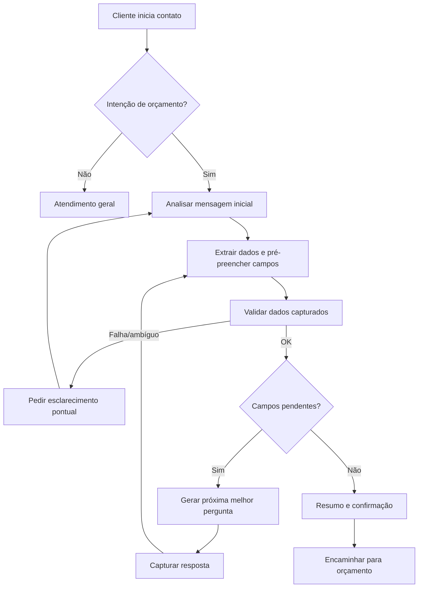

# REQ-002: Fluxo Conversacional Guiado

<!-- CLASSIFICACAO: SISTEMA-CAIXAPRETA -->
<!-- CLASSIFICACAO: IA -->

**Versão**: 1.37  
**Data**: 2026-07-28  
**Autor**: Kika (Analista de Requisitos)  
**Status**: Em Elaboração  
**Prioridade**: Alta  

---

## 1. Identificação do Requisito

**ID**: REQ-002  
**Tipo**: Funcional  
**Categoria**: UX/Conversação  
**Solicitante**: vendedor (Inforrel)  

---

## 2. Descrição

O sistema deve conduzir conversas de forma estruturada, porém **adaptativa**, coletando informações essenciais do cliente a partir da análise do **primeiro contato** e das mensagens subsequentes. Em vez de seguir uma sequência fixa de perguntas, o sistema deve:

- Identificar a intenção do cliente (ex: orçamento de relógio, orçamento de catraca, controle de acesso)
- Extrair entidades e dados já informados (ex: CNPJ, endereço, modelo/tecnologia, quantidade)
- Determinar quais informações estão faltando para viabilizar o orçamento
- Fazer **apenas as próximas perguntas necessárias** (perguntas dinâmicas), na melhor ordem para aquele caso

---

## 3. Justificativa de Negócio

**Problema Atual**:
- vendedor precisa fazer as mesmas perguntas repetidamente
- Processo manual e suscetível a esquecimentos
- Clientes podem não fornecer todas as informações necessárias

**Benefício Esperado**:
- Padronização da qualificação de leads
- Redução de tempo no atendimento
- Melhor experiência para o cliente
- Dados completos para elaboração de orçamentos

**Feedback do vendedor**: "seria interessante se tivesse algumas perguntas. Ex: qual o CNPJ, após ele responder o sistema faz outra pergunta e assim vai."

---

## 4. Critérios de Aceite

### 4.1 Funcionalidades Obrigatórias

- [ ] **REQ-002.1 — Classificação e roteamento das mensagens do cliente**: Toda mensagem recebida do cliente deve passar por um classificador que decide qual fluxo deve tratá-la. O sistema deve identificar uma de quatro categorias e direcionar a mensagem para o requisito correspondente:

  | # | Categoria | Roteamento |
  |---|-----------|------------|
  | 1 | **Intenção de compra/orçamento (mensagem inicial)** | Ativa o modo de qualificação no **REQ-002** e segue para a primeira pergunta dinâmica |
  | 2 | **Tratamento da resposta do cliente a uma pergunta feita pelo sistema** | Tratada pelo **REQ-002**: o conteúdo da mensagem é registrado como resposta à pergunta que o sistema havia feito (ex.: pergunta "qual o CNPJ?" → mensagem do cliente é gravada no campo `cnpj` do atendimento); em seguida o sistema avança para a próxima pergunta pendente |
  | 3 | **Pergunta sobre produto/serviço/empresa** | Delegada ao **REQ-003** (consulta à base de respostas automáticas / RAG) |
  | 4 | **Pedido de atendimento humano ou situação crítica** | Delegada ao **REQ-004** (escalonamento para humano) |

  Os números das categorias (1 a 4) são **estáveis** e referenciados por outros requisitos (ex.: REQ-002.1A menciona "categoria 2", "categoria 3"); não devem ser renumerados em revisões futuras.

  Este requisito é a **porta de entrada** do sistema: nenhuma mensagem do cliente deve ser processada sem antes passar por essa classificação. As regras específicas de cada fluxo (REQ-002.17, REQ-003.1, REQ-004.1) descrevem **o que fazer após** o roteamento.

- [ ] **REQ-002.1A — Fallback condicional para classificação ambígua ou de baixa confiança**: O classificador do REQ-002.1 deve, junto com a categoria escolhida, expor **dois indicadores de confiança**:
  - `confianca` (float, `0.0` a `1.0`) — score numérico retornado pelo classificador
  - `confianca_nivel` (enum: `alta` | `media` | `baixa`) — derivado dos limiares configuráveis em REQ-014 (`classificador_conf_alta_min`, `classificador_conf_baixa_max`), com defaults `0.70` e `0.40` respectivamente:
    - `confianca >= classificador_conf_alta_min` → **alta**
    - `classificador_conf_baixa_max <= confianca < classificador_conf_alta_min` → **media**
    - `confianca < classificador_conf_baixa_max` ou categoria `"nao_identificado"` → **baixa**

  Opcionalmente, o classificador pode expor `justificativa_curta` (string) para auditoria (REQ-005.6).

  **Ordem de processamento obrigatória**: toda mensagem passa primeiro pelo classificador (REQ-002.1); **somente depois** o processador decide qual requisito acionar.

  O sistema deve aplicar a seguinte ordem de tratamento **após** a classificação:

  **Caso 1 — Confiança alta (`confianca_nivel = alta`)**: rotear diretamente para o fluxo correspondente (REQ-002, REQ-003 ou REQ-004), sem consultas adicionais de fallback.

  **Caso 1b — Confiança média (`confianca_nivel = media`)**: **não** acionar fallback automático para REQ-003. Seguir para **REQ-002.21** (pedir esclarecimento ao cliente). Após tentativas esgotadas, escalar via REQ-004.9.

  **Caso 2 — Confiança baixa OU classificador retornou "não identificado" (`confianca_nivel = baixa`)**: antes de devolver mensagem de fallback genérica ao cliente, o sistema deve **tentar uma consulta à base de respostas automáticas (REQ-003)** como último recurso de compreensão:
  - Se REQ-003 retornar resposta com **confiança aceitável** (par Q&A aprovado ou trecho de RAG com score acima do limiar configurado em REQ-014) → entrega a resposta ao cliente, registrando no modal de raciocínio (REQ-005.6) que houve **fallback via REQ-003** e qual foi a confiança do classificador original.
  - Se REQ-003 **também** não retornar resposta confiável → segue para o tratamento de ambígua/não entendida já previsto em REQ-002.21 (pedir esclarecimento ao cliente; após tentativas esgotadas, escalar via REQ-004.9).

  **Caso 3 — Mensagem composta: resposta + outra pergunta**

  Quando a mensagem do cliente contiver **duas partes** — uma resposta a uma pergunta anterior e uma nova pergunta embutida — o sistema **DEVE** processar ambas na mesma resposta:
  1. **Parte 1 (resposta)**: capturar o dado respondido e atualizar o campo correspondente (cat. 2).
  2. **Parte 2 (pergunta embutida)**: classificar a pergunta segundo o REQ-002.1 e roteá-la para a categoria adequada (REQ-003 para perguntas sobre produto/serviço/empresa; REQ-004 para pedido de atendimento humano ou situação crítica; etc.).
  3. **Resposta ao cliente**: combinar as duas ações numa única resposta — confirmação do dado capturado + resposta à pergunta embutida.

  Exemplo: o sistema acabou de perguntar `"quantas catracas você precisa?"` e o cliente responde `"5, mas vocês têm modelo com biometria facial?"` — o sistema captura `quantidade=5` (cat. 2) e também responde sobre biometria facial via REQ-003.

  **Caso 4 — Resposta com citação de pergunta (WhatsApp reply)**

  Quando o cliente usar o recurso "Responder" do WhatsApp, gerando uma mensagem com citação/bloco de citação, o sistema deve usar o texto citado para identificar a qual pergunta anterior a resposta se refere, antes de aplicar a classificação do REQ-002.1:
  - Extrair o **texto citado** (pergunta original) e o **texto digitado** pelo cliente.
  - Comparar o texto citado com as perguntas recentes do sistema no atendimento (especialmente perguntas pendentes de qualificação).
  - Se houver correspondência com uma pergunta de qualificação: tratar o texto digitado como **resposta direta daquele campo**, mesmo que a resposta chegue fora de ordem ou após outras mensagens.
  - Se não houver correspondência com pergunta do sistema, ou o texto citado não for identificável: tratar o texto digitado como mensagem normal, aplicando REQ-002.1.
  - Se o texto digitado também contiver uma nova pergunta: aplicar o **Caso 3** (mensagem composta), vinculando a resposta ao campo da citação e respondendo a dúvida embutida.

  Exemplo: o sistema perguntou `"Qual o CNPJ?"` e depois `"Quantas catracas?"`. O cliente cita `"Qual o CNPJ?"` e responde `"12.345.678/0001-99"`. O sistema identifica que a resposta é para `CAMPO-cnpj`, não para `quantidade`.

  **Auditoria**: cada decisão de fallback deve ser registrada em REQ-005.6 contendo:
  - categoria escolhida pelo classificador, `confianca` e `confianca_nivel`
  - se houve fallback para REQ-003 (sim/não)
  - resultado do fallback (resposta entregue / pediu esclarecimento / escalou)

- [ ] **REQ-002.1B — Perguntas sobre produto/empresa antes da identificação fiscal**: Quando o classificador (REQ-002.1) identificar **categoria 3** (pergunta sobre produto/serviço/empresa) com confiança **alta**, o sistema deve delegar ao **REQ-003** **mesmo que o cliente ainda não tenha informado documento fiscal** (CNPJ ou CPF).

  **Comportamento esperado**:
  - Se o telefone for **novo** ou o contato existir **sem empresa vinculada**, o sistema deve **criar contato e atendimento anônimos** (`empresa_id = null`, `tipo_documento = indefinido`) para registrar a conversa, **sem** bloquear a resposta com saudação genérica ou pedido imediato de CNPJ.
  - A resposta ao cliente vem do REQ-003 (Q&A ou RAG conforme roteamento normal da cat. 3).
  - Após o cliente informar CNPJ ou CPF em mensagem posterior, o sistema **promove** o contato/atendimento existente, vinculando empresa (REQ-001) ou pessoa (REQ-015), preservando o histórico da conversa.
  - Este requisito prepara o suporte a **Pessoa Física** (REQ-002.2A / REQ-015): o atendimento pode existir antes da identificação fiscal, seja PJ ou PF.

  **O que não muda**: categorias 1, 2 e 4 continuam exigindo o fluxo de qualificação/identificação conforme REQ-002.2 em diante. Apenas cat. 3 com confiança alta tem tratamento especial pré-identificação.

- [ ] **REQ-002.1C — Roteamento entre fases do catálogo de conversação**: O sistema deve implementar as fases e perguntas descritas no `catalogo_conversacao` (FASE-esclarecendo, FASE-finalizando, FASE-criando-orcamento, FASE-encerrado-por-inatividade, FASE-encerrado) como estados operacionais do atendimento.

  **Papéis conceituais das fases**:
  - **FASE-esclarecendo** — fase **reativa**: o sistema responde dúvidas do cliente sobre produtos/serviços (Q&A/RAG) e acumula passivamente dados informados espontaneamente.
  - **FASE-finalizando** — fase **ativa**: o sistema cobra os campos pendentes para elaboração do orçamento (`CAMPO-modelo`, `CAMPO-software-ponto`, `CAMPO-faixa-funcionarios`, `CAMPO-quantidade`, `CAMPO-endereco`, `CAMPO-contato`, etc.). O cliente deve apenas responder às perguntas.

  **Transição Esclarecendo → Finalizando** (por intenção + produto):
  - O sistema deve transitar de FASE-esclarecendo para FASE-finalizando quando **todas** as condições forem satisfeitas:
    1. O cliente manifestar intenção explícita de orçamento/compra (categoria 1 do REQ-002.1); **E**
    2. O tipo de produto estiver identificado (REQ-002.3A — ex.: "relógio de ponto", "catraca"); **E**
    3. A mensagem **não** contiver também uma dúvida (categoria 3 do REQ-002.1).
  - **Não** é necessário que modelo, quantidade, software ou outros campos já estejam confirmados — apenas intenção + tipo de produto + ausência de dúvida.
  - Se o cliente manifestar intenção de orçamento mas o tipo de produto ainda não for conhecido, o sistema permanece em FASE-esclarecendo e pergunta o tipo de produto (REQ-002.3A). Ao obter a resposta (sem dúvida pendente), transita para Finalizando.
  - **Mensagem composta com intenção + dúvida** (Caso 3 do REQ-002.1A): quando a mensagem contiver intenção de orçamento **e** uma dúvida sobre qualquer produto (mesmo diferente do solicitado), o sistema:
    1. Registra a intenção e o tipo de produto identificado (captura passiva).
    2. **Permanece em FASE-esclarecendo** e responde à dúvida via Q&A/RAG.
    3. Só transita para Finalizando quando a dúvida for resolvida (próxima mensagem sem cat. 3).
    - Exemplo: "Quero orçamento de catraca, mas vocês vendem câmeras IP?" → sistema registra interesse em catraca, responde sobre câmeras, permanece em Esclarecendo. Na próxima mensagem, se não houver dúvida, transita para Finalizando (catraca).
  - Ao transitar, o sistema envia uma mensagem de transição (ex.: "Ótimo! Vou precisar de algumas informações para montar o orçamento.") e inicia a coleta do primeiro campo pendente (`campos_pendentes()`, ordenado por prioridade).
  - Se a mensagem que disparou a transição já contiver dados de campos (ex.: "quero orçamento de relógio de ponto, já uso o Domínio"), esses dados são capturados na mesma resposta — o sistema só pergunta o que ainda faltar.
  - Se a mensagem inicial já contiver todos os dados mínimos para orçamento e não contiver dúvida, o sistema pode iniciar diretamente em FASE-finalizando (sem passar por FASE-esclarecendo).

  **Retorno Finalizando → Esclarecendo** (por dúvida):
  - Se, durante a coleta em FASE-finalizando, o cliente fizer uma **pergunta/dúvida** (classificada como categoria 3 do REQ-002.1) — sobre qualquer assunto, seja o produto em coleta ou outro produto — o sistema deve transitar de volta para FASE-esclarecendo para responder à dúvida.
  - O progresso da coleta é preservado — campos já capturados permanecem inalterados.
  - Exemplos:
    - Dúvida sobre o produto em coleta: sistema pergunta modelo → cliente responde "qual a diferença do biométrico pro facial?" → transita para Esclarecendo.
    - Dúvida sobre outro produto: sistema pergunta modelo da catraca → cliente responde "vocês fazem manutenção de relógio também?" → transita para Esclarecendo.

  **Retorno Esclarecendo → Finalizando** (dúvida resolvida):
  - Após responder a dúvida em Esclarecendo, se a próxima mensagem do cliente **não** for classificada como nova dúvida (categoria 3), o sistema transita automaticamente de volta para FASE-finalizando e retoma a coleta a partir do campo pendente.
  - Se a próxima mensagem for outra dúvida (categoria 3), o sistema permanece em Esclarecendo e responde normalmente — só retorna a Finalizando quando as dúvidas cessarem.
  - Ao retornar, o sistema reapresenta a pergunta do campo pendente (ex.: "Voltando ao orçamento: qual modelo você prefere?").

  **Referências ao catálogo**:
  - FASE-esclarecendo: `artefatos/analista_de_requisitos/catalogo_conversacao/fases/FASE-esclarecendo.md`
  - FASE-finalizando: `artefatos/analista_de_requisitos/catalogo_conversacao/fases/FASE-finalizando.md`
  - PERG-002-022: `artefatos/analista_de_requisitos/catalogo_conversacao/perguntas/PERG-002-022.md`
  - PERG-016-009, PERG-016-010: `artefatos/analista_de_requisitos/catalogo_conversacao/perguntas/PERG-016-009.md` e `PERG-016-010.md`

- [ ] **REQ-002.2 — Identificar dados iniciais do cliente e armazená-los**: Sistema deve analisar a mensagem inicial e **pré-preencher** os dados já fornecidos pelo cliente (quando identificáveis), vinculando-os aos campos do catálogo de conversação (`CAMPO-cnpj`, `CAMPO-cpf`, `CAMPO-software-ponto`, etc.).

  **Primeiro contato com todos os dados**: se a mensagem inicial já contiver os dados mínimos para orçamento (tipo de produto, modelo, quantidade/faixa e documento fiscal quando identificável), o sistema pode iniciar diretamente em FASE-finalizando (REQ-002.1C), ecoando os dados para confirmação antes de seguir (REQ-002.16).

- [ ] **REQ-002.2A — Identificar tipo de cliente (Pessoa Física ou Pessoa Jurídica)**: Logo após a intenção de orçamento ser detectada (REQ-002.1) e antes de pedir documento fiscal, o sistema deve identificar se o solicitante é **Pessoa Física (PF)** ou **Pessoa Jurídica (PJ)**.

  **Regras de inferência**:
  - Se a mensagem inicial mencionar CNPJ, razão social, nome fantasia ou termos como "empresa", "minha empresa", "para a empresa", "escritório", "loja" → **PJ**
  - Se a mensagem mencionar CPF, ou termos como "para mim", "residencial", "para minha casa", "pessoa física" → **PF**
  - Em caso de ambiguidade, o sistema deve perguntar diretamente (template do catálogo de conversação `PERG-002-2A`): "O orçamento é para uma **empresa** (CNPJ) ou para **pessoa física** (CPF)?"

  **Roteamento**:
  - **PJ** → segue REQ-001 (consulta CNPJ na Receita Federal)
  - **PF** → segue REQ-015 (validação de CPF e consulta de débitos)

  Os dois fluxos são mutuamente exclusivos na mesma conversa: nunca se pede CNPJ e CPF ao mesmo tempo. Se o cliente trocar de tipo no meio da conversa (ex: começa como PF e depois informa CNPJ da empresa), o sistema deve fazer uma confirmação pontual e reiniciar a coleta do documento fiscal apropriado, preservando os demais campos já capturados.

- [ ] **REQ-002.3 — Controle de estado dos campos de qualificação**: Sistema deve manter um conjunto de informações necessárias para orçamento (campos do catálogo de conversação: `CAMPO-cnpj`, `CAMPO-cpf`, `CAMPO-modelo`, `CAMPO-software-ponto`, `CAMPO-quantidade`, `CAMPO-faixa-funcionarios`, `CAMPO-contato`, `CAMPO-endereco`) e marcar cada campo como:
  - Capturado
  - Pendente
  - Não aplicável

- [ ] **REQ-002.3A — Identificar tipo de produto/serviço solicitado pelo cliente**: Sistema deve identificar, logo após a intenção ser detectada (REQ-002.1), qual o **tipo de produto/serviço** que o cliente está solicitando, entre as categorias atendidas pela Inforrel:
  - Relógio de ponto (controle de ponto)
  - Catraca / controle de acesso
  - Câmeras / CFTV
  - Roteadores
  - Softwares
  - Cancelas
  - Assistência técnica
  - Outro / não identificado

  Quando o tipo não estiver claro na mensagem inicial, o sistema deve fazer uma pergunta direta para classificar antes de prosseguir com a qualificação dos demais campos. O tipo identificado direciona as próximas perguntas dinâmicas (REQ-002.4) e as regras específicas por produto (REQ-002.14, REQ-002.14A). Dado registrado internamente como tipo de produto (não há CAMPO específico — faz parte da estrutura do atendimento).

- [ ] **REQ-002.3B — Identificar modelo do produto**: Após identificar o tipo (REQ-002.3A), o sistema deve identificar o **modelo específico** do produto solicitado. Exemplos por tipo:
  - **Catraca**: Fit, Box, Pedestal, Giratória, Cancela, etc.
  - **Relógio de ponto**: cartográfico ou eletrônico, este último com tecnologia (cartão de proximidade, cartão de barras, biometria, reconhecimento facial)
  - **Câmeras / CFTV, Roteadores, Softwares, Cancelas, Assistência técnica**: modelo/especificação conforme catálogo Inforrel

  Quando o modelo não estiver claro, o sistema deve perguntar diretamente, oferecendo a lista de opções válidas para o tipo de produto correspondente. Se o modelo informado pelo cliente **não existir no catálogo**, o sistema deve informar que não reconheceu esse modelo e reapresentar as opções válidas — **nunca** armazenar texto livre como modelo. Após 2 tentativas sem correspondência, escalar para atendimento humano (REQ-002.21). Dado registrado no catálogo de conversação como `CAMPO-modelo`.

- [ ] **REQ-002.3C — Coletar informações adicionais para orçamento**: O sistema deve coletar os dados complementares que não pertencem nem ao tipo/modelo nem ao endereço de entrega:
  - **Nome do solicitante** — **obrigatório para PF** (substitui a função identificadora da razão social, que existe apenas para PJ); **recomendado para PJ** quando informado pelo cliente (útil para tratamento personalizado, mas não bloqueia a qualificação se ausente)
  - Faixa de pessoas (funcionários/usuários) → `CAMPO-faixa-funcionarios`
  - Software de controle de ponto existente, quando aplicável → `CAMPO-software-ponto`
  - Software de controle de acesso existente, quando aplicável → `CAMPO-software-acesso`
  - Interesse em sistema de controle de acesso na nuvem, quando aplicável → `CAMPO-interesse-sistema-nuvem`
  - Homologação com software de controle de acesso de terceiros, quando aplicável → `CAMPO-homologado-software`
  - Quantidade de equipamentos → `CAMPO-quantidade`
  - Contato para envio do orçamento (e-mail e/ou telefone) → `CAMPO-contato`

  Esta etapa aciona as regras específicas REQ-002.14 (relógio de ponto sem software), REQ-002.14A (catraca sem software e interesse em sistema na nuvem), REQ-002.14B (catraca sem software e sem interesse em sistema na nuvem), REQ-002.14C (catraca com software EVO/Pacto/SCA/Panobianco/Sky) e REQ-002.15 (catraca com outro software existente). A flexibilidade de formato da faixa de pessoas é tratada pela validação em REQ-002.6.

  **Observação sobre o nome do solicitante PF**: o nome capturado aqui é usado, entre outros, como identificador do cliente no painel administrativo (REQ-010.7A) substituindo o papel que a razão social cumpre para PJ. Por se tratar de dado pessoal, segue as mesmas regras LGPD aplicáveis ao CPF (REQ-015.13) no que diz respeito a uso restrito ao orçamento e não indexação pelo RAG (REQ-003).

- [ ] **REQ-002.3D — Coletar informações de endereço de entrega/instalação**: O sistema deve coletar o endereço completo onde o produto será entregue ou instalado:
  - Logradouro, número, complemento, bairro
  - Cidade, UF, CEP
  - Indicador se a operação é de instalação no local, apenas entrega ou retirada

  Quando o endereço vier preenchido em parte pela mensagem inicial (REQ-002.2), o sistema deve solicitar apenas os elementos faltantes. Dado registrado no catálogo de conversação como `CAMPO-endereco`.

- [ ] **REQ-002.4 — Mecanismo geral de definição de perguntas dinâmicas**: Sistema deve solicitar **apenas** os campos pendentes (perguntas dinâmicas), podendo alterar a ordem conforme o contexto

- [ ] **REQ-002.5 — Sumarização de dados de orçamento**: Visão consolidada dos campos coletados pelas etapas REQ-002.2, REQ-002.3A, REQ-002.3B, REQ-002.3C e REQ-002.3D. O conjunto de campos varia conforme o tipo de cliente identificado em REQ-002.2A. O sistema só deve considerar a qualificação concluída quando todos os campos abaixo estiverem capturados ou marcados como não aplicáveis.

  **Resumo final do pedido**: ao completar a qualificação (FASE-finalizando), o sistema deve apresentar o resumo dos dados capturados e pedir confirmação antes de transitar para FASE-criando-orcamento. Este resumo é diferente do eco inicial do REQ-002.16: o eco trata dos dados extraídos da mensagem inicial; o resumo final valida o pedido completo.

  **Campos comuns (PF e PJ)**:
  - Tipo de cliente (PF/PJ) — capturado em REQ-002.2A
  - Tipo de produto/serviço — capturado em REQ-002.3A
  - Modelo/especificação do produto — capturado em REQ-002.3B
  - Faixa de pessoas (quando aplicável conforme REQ-002.14 e REQ-002.14A) — capturado em REQ-002.3C
  - Quantidade de equipamentos (quando aplicável conforme REQ-002.14A, REQ-002.14B e REQ-002.15) — capturado em REQ-002.3C
  - Software de controle de ponto existente (se aplicável) — capturado em REQ-002.3C
  - Software de controle de acesso existente (se aplicável) — capturado em REQ-002.3C
  - Interesse em sistema de controle de acesso na nuvem (se aplicável) — capturado em REQ-002.3C
  - Homologação com software de controle de acesso de terceiros (se aplicável) — capturado em REQ-002.3C
  - Contato para orçamento — capturado em REQ-002.3C
  - Endereço de entrega/instalação — capturado em REQ-002.3D

  **Campos específicos para PJ**:
  - CNPJ (integrado com REQ-001) — capturado em REQ-002.2 ou perguntado em REQ-002.2A
  - Razão social / nome fantasia (consequência da consulta REQ-001.3)

  **Campos específicos para PF**:
  - CPF (integrado com REQ-015) — capturado em REQ-002.2 ou perguntado em REQ-002.2A
  - Nome do solicitante (PF não tem razão social; o nome é pedido em REQ-002.3C como parte do contato)
  - Indicador de restrição financeira (consequência da consulta REQ-015.3) — informação interna, não exibida ao cliente

- [ ] **REQ-002.6 — Validação de respostas capturadas**: Sistema deve validar cada resposta capturada antes de considerar o campo como completo:
  - Formato de CNPJ (REQ-001.2)
  - Formato e dígitos verificadores de CPF (REQ-015.2)
  - Modelo de produto válido
  - Endereço completo
  - E-mail/telefone válidos
  - Quantidade/faixa de pessoas: aceita número exato ou faixa/aproximação (ex: “até 50”, “51-100”, “100+”), desde que permita dimensionamento

### 4.2 Regras de Negócio

- [ ] **REQ-002.10 — Reuso de documento fiscal já validado**: Se cliente já tiver **CNPJ** (REQ-001) ou **CPF** (REQ-015) validado em conversa anterior do mesmo telefone, o sistema não deve pedir o documento novamente, a menos que haja conflito de dados, como:
  - Cliente informar um documento diferente em mensagem posterior (retificação)
  - Cliente solicitar explicitamente troca (ex: matriz vs filial; PF vs PJ)
  - Documento consultado retornar dados que contradizem fortemente o contexto informado (ex: cliente afirma ser Empresa X, mas o CNPJ retorna outra razão social)
  - Mudança de tipo de cliente (PF→PJ ou PJ→PF) detectada em REQ-002.2A

  Nesses casos, o sistema deve fazer uma confirmação pontual (ex: “Você mencionou dois CNPJs diferentes. Qual devo usar para o orçamento?” ou “Antes você fez orçamento como pessoa física; agora é para uma empresa?”)

- [ ] **REQ-002.14 — Relógio de ponto sem software: faixa de pessoas**: Para relógio de ponto, se o cliente não tiver software de controle de ponto (`CAMPO-software-ponto = nenhum`), o sistema deve solicitar a **faixa de pessoas** (`CAMPO-faixa-funcionarios`) como resposta obrigatória para concluir a qualificação.

- [ ] **REQ-002.14A — Catraca sem software e interesse em sistema na nuvem**: Para catraca, se o cliente não tiver software de controle de acesso (`CAMPO-software-acesso = nenhum`) e manifestar interesse em adquirir um sistema de controle de acesso na nuvem (`CAMPO-interesse-sistema-nuvem = sim`), o sistema deve solicitar:
  1. A **faixa de pessoas** (`CAMPO-faixa-funcionarios`); e
  2. A **quantidade de equipamentos** (`CAMPO-quantidade`).
  Ambas são obrigatórias para concluir a qualificação nesse cenário.

- [ ] **REQ-002.14B — Catraca sem software e sem interesse em sistema na nuvem**: Para catraca, se o cliente não tiver software de controle de acesso (`CAMPO-software-acesso = nenhum`) e não quiser adquirir um sistema de controle de acesso na nuvem (`CAMPO-interesse-sistema-nuvem = não`), o sistema deve solicitar **apenas a quantidade de equipamentos** (`CAMPO-quantidade`) como resposta obrigatória.

- [ ] **REQ-002.14C — Catraca com software conhecido (EVO, Pacto, SCA e franquias associadas como Panobianco/Sky): alerta de homologação**: Para catraca, se o cliente já usar um software de controle de acesso conhecido (`CAMPO-software-acesso` reconhecido no catálogo, ex.: EVO, Pacto, SCA — incluindo quando o cliente citar uma franquia como Panobianco ou Sky, que tipicamente operam sobre EVO), o sistema deve perguntar se o cliente já verificou a **homologação** entre o modelo de catraca/leitor desejado e aquele software (`CAMPO-homologado-software`), reforçando que é importante confirmar isso **antes da compra** para evitar incompatibilidade.

  Esta pergunta é **apenas um alerta/orientação ao cliente** — a resposta é opcional e **não bloqueia nem torna obrigatória** a conclusão da qualificação. O sistema deve apenas controlar que a pergunta foi feita (`CAMPO-homologado-software` = pendente/perguntado/respondida), sem exigir confirmação para avançar. Se o cliente não souber ou não responder, o sistema registra o que houver e segue o fluxo normalmente.

- [ ] **REQ-002.15 — Catraca com outro software existente: quantidade obrigatória**: Para catraca, se o cliente já tiver um software de controle de acesso que **não** seja reconhecido no catálogo (ex.: não é EVO, Pacto, SCA, nem citado via franquia como Panobianco/Sky), incluindo "não sei", o sistema deve solicitar a **quantidade de equipamentos** (`CAMPO-quantidade`) como resposta obrigatória. A faixa de pessoas é opcional nesse cenário e pode ser pulada se o cliente não souber ou não quiser informar.

  Assim como no REQ-002.14C, o sistema também deve exibir o **alerta/orientação de homologação** (`CAMPO-homologado-software`) neste cenário — mesmo sem reconhecer o software específico, é ainda mais importante reforçar que o cliente verifique a compatibilidade com o fornecedor do software antes da compra. A pergunta segue **opcional e não bloqueante**: o sistema só controla que o alerta foi exibido, sem exigir resposta para avançar.

- [ ] **REQ-002.16 — Confirmação dos dados extraídos da mensagem inicial**: Quando o sistema extrair um ou mais dados da **mensagem inicial** do cliente (REQ-002.2), deve validar se é necessário confirmar a interpretação antes de prosseguir. A confirmação **não deve ocorrer a cada campo** nem a cada mensagem — apenas quando o risco de interpretação incorreta for relevante.

  **Quando ecoar (critérios)**:
  - Sempre que houver **ambiguidade** ou baixa confiança na extração (ex: endereço incompleto, modelo não reconhecido, quantidade com faixa aproximada).
  - Quando forem extraídos **múltiplos campos relevantes** de uma só mensagem (ex: tipo, modelo, quantidade e CNPJ) — neste caso, o eco pode ser consolidado numa única mensagem.
  - Quando o cliente não tiver confirmado implicitamente o dado (ex: disse "preciso de 5 catracas" → eco pode ser suprimido para quantidade, mas mantido para modelo/endereço se extraídos automaticamente).

  **Como ecoar**:
  - Preferir **mensagem única consolidada** com os dados entendidos, em vez de um eco por campo.
  - Oferecer ao cliente a chance de corrigir apenas o que estiver incorreto; campos certos não precisam ser reconfirmados.
  - Não usar a confirmação como "passo obrigatório" se não houver dúvida razoável.

  **Interação com REQ-001.4 (CNPJ)**: quando um dos dados extraídos for o **CNPJ**, a confirmação desse campo é satisfeita pelo **REQ-001.4**. O REQ-002.16 não deve gerar uma segunda confirmação do CNPJ; o eco cobre apenas os **demais campos** extraídos (tipo, modelo, quantidade, endereço, contato). Quando possível, consolidar CNPJ + demais campos numa **única mensagem de resumo**.

  **Diferença para o resumo final**: o eco do REQ-002.16 valida a interpretação da **mensagem inicial**. O **resumo final do pedido** é tratado pelo REQ-002.5, após todos os campos obrigatórios estarem capturados, e pede confirmação antes de encaminhar para o vendedor. Ver também FASE-finalizando.md.

- [ ] **REQ-002.17 — Consulta à base de respostas automáticas durante a qualificação**: Durante o fluxo de qualificação, se o cliente enviar uma **pergunta sobre produto/serviço** (ex: características técnicas, compatibilidade, preço, prazos, catálogo, serviços prestados), o sistema deve:
  - Delegar a resposta ao REQ-003 (Base de Conhecimento / RAG)
  - Após responder a dúvida, **retomar a qualificação** no ponto em que estava, reapresentando a última pergunta pendente
  - Não descartar os dados já capturados
  - Quando a pergunta sobre produto estiver embutida em uma resposta a uma pergunta de decisão do catálogo, aplicar também as regras de **Desvios e robustez** da PERG correspondente (REQ-002.1A Caso 3).

- [ ] **REQ-002.22 — Tratamento de abandono de conversa pelo cliente**: Se o cliente parar de responder durante o fluxo de qualificação, o sistema deve usar os parâmetros configuráveis definidos em REQ-014.2D, aplicando os valores vigentes no momento da verificação:
  - Considerar a conversa **inativa** após `abandono_inatividade_horas` sem nova mensagem do cliente (default: 24h)
  - Enviar **mensagem de reengajamento** (PERG-002-022 do catálogo de conversação) perguntando se o cliente quer continuar (ex: “Você ainda está aí? Posso continuar de onde paramos?”). A quantidade máxima de mensagens de reengajamento é controlada por `abandono_reengajamento_max_mensagens` (default: 1 no POC).
  - Após `abandono_total_horas` sem resposta do cliente, transicionar a conversa para o estado `Finalização` (REQ-005.3) com motivo `abandono` (default: 72h). O valor de `abandono_total_horas` deve ser maior que `abandono_inatividade_horas`.
  - **Preservar os dados já capturados** no histórico (não descartar)
  - Se o cliente voltar a enviar mensagens depois da finalização por abandono, **iniciar uma nova conversa** (passando novamente pelo classificador do REQ-002.1); quando se tratar do mesmo telefone/CNPJ, o sistema pode oferecer retomar de onde a conversa anterior parou (ex: “Vi que você já tinha conversado conosco. Quer continuar de onde paramos?”)

### 4.3 Requisitos Não-Funcionais

- [ ] **REQ-002.19 — Tempo de resposta entre perguntas**: Tempo de resposta entre perguntas: < 2 segundos
- [ ] **REQ-002.20 — Naturalidade da conversa**: Conversa deve parecer natural, não robótica
- [ ] **REQ-002.21 — Tratamento de respostas ambíguas**: O sistema deve lidar com respostas ambíguas do cliente seguindo esta política:
  - **Reconhecimento de ambiguidade**: considerar ambígua qualquer resposta que (a) não satisfaça a validação do REQ-002.6, (b) admita mais de uma interpretação plausível para o campo em questão, ou (c) seja vazia / desviada do tema
  - **Pergunta de esclarecimento dirigida**: na primeira ocorrência, reformular a pergunta de forma mais específica e, quando possível, oferecer **opções enumeradas** (ex: "Você quer (1) Pedestal, (2) Giratória ou (3) Cancela?") para reduzir o espaço de resposta
  - **Limite de tentativas por campo**: até **2 tentativas adicionais** de esclarecimento por campo (3 interações no total para o mesmo campo). Esgotadas as tentativas sem clareza, o sistema deve **escalar para humano** (REQ-004.9 — baixa confiança) com o contexto da pergunta, as respostas recebidas e os campos já capturados, **preservando os dados válidos** (alinhado a REQ-002.22)
  - **Pergunta sobre produto camuflada de resposta**: se a resposta ambígua for, na verdade, uma pergunta sobre produto/serviço, aplicar o REQ-002.17 (delegar ao REQ-003) em vez de consumir tentativa
  - **Auditoria**: cada esclarecimento e seu desfecho devem ser registrados como evento (REQ-005.1 / REQ-005.2)

### 4.4 Terminologia

Para evitar ambiguidade, este requisito adota a seguinte terminologia:

- **Pergunta de qualificação**: pergunta feita pelo **sistema** para coletar um dado necessário ao orçamento (ex: "Qual o CNPJ?", "Quantos funcionários vão bater ponto?", "Catraca pedestal, giratória ou cancela?"). Sempre tratada pelo REQ-002.
- **Resposta de qualificação**: mensagem do **cliente** respondendo a uma pergunta de qualificação. Captura em campo (ver REQ-002.3).
- **Pergunta sobre produto/serviço**: mensagem do **cliente** com dúvida que exige consulta à base de conhecimento (catálogo, FAQ, manuais, preços, prazos, compatibilidade, serviços). Delegada ao REQ-003.
- **Mensagem de escalonamento**: pedido explícito de atendimento humano ou sinal de situação crítica. Delegada ao REQ-004.

---

## 5. Fluxograma da Conversa



---

## 6. Exemplos de Fluxo

### 6.1 Fluxo Completo - Relógio de Ponto

```
Cliente: "Olá, preciso de orçamento de relógio de ponto biométrico para 50 funcionários. Meu CNPJ é 12.345.678/0001-90. Entrega em São Paulo/SP."

Sistema: "Entendi! Vou preparar seu orçamento.
✅ Empresa identificada: RAZÃO SOCIAL LTDA
✅ Produto: Relógio de ponto biométrico
✅ Local: São Paulo/SP

Falta só confirmar:
1) Endereço completo (rua, número e bairro)
2) Um e-mail para envio do orçamento

Pode me passar o endereço completo?"

Cliente: "Rua Exemplo, 123 - Centro - São Paulo/SP"

Sistema: "Perfeito. E qual e-mail posso usar para te enviar o orçamento?"

Cliente: "contato@empresa.com"

Sistema: "Resumo do seu pedido:
- Empresa: RAZÃO SOCIAL LTDA
- Produto: Relógio de ponto biométrico
- Entrega: Rua Exemplo, 123 - Centro - São Paulo/SP
- Funcionários: 50
- Contato: contato@empresa.com

Posso encaminhar para elaboração do orçamento? (S/N)"
```

### 6.2 Tratamento de Exceções

```
Cliente: "Quero um orçamento de catraca para academia"

Sistema: "Claro! Só para eu direcionar certinho: você quer catraca de que tipo?
1. Pedestal
2. Giratória
3. Cancela"
```

### 6.3 Interação entre REQ-002 e REQ-003 (qualificação intercalada com dúvidas)

Durante a qualificação, o cliente pode fazer perguntas sobre produto/serviço que saem do roteiro. O sistema deve responder via RAG (REQ-003) e depois **retomar** a qualificação de onde parou:

```
Cliente: "Oi, preciso de orçamento de relógio de ponto para 80 funcionários."
  → REQ-002 captura: produto=relógio de ponto, faixa de funcionários≈80

Sistema: "Perfeito! Sua empresa já tem software de controle de ponto?"
  → Pergunta de qualificação (REQ-002)

Cliente: "Ainda não. Aliás, qual a diferença entre biométrico e facial?"
  → Pergunta sobre produto/serviço (delegada ao REQ-003)

Sistema: "Boa pergunta! O biométrico identifica pela digital do dedo,
enquanto o facial reconhece pelo rosto — mais rápido e sem contato.
[resposta gerada via RAG sobre catálogo Inforrel]

Voltando ao seu orçamento: você prefere biométrico ou facial?"
  → REQ-002 retoma a qualificação no ponto em que estava

Cliente: "Facial."
  → REQ-002 captura: tecnologia=facial
```

---

## 7. Dependências

### 7.1 Dependências Técnicas
- REQ-001: Integração Receita Federal
- Motor de IA para processamento de respostas
- Sistema de validação de dados

### 7.2 Dependências de Negócio
- Definição dos modelos de produtos
- Lista de softwares homologados
- Critérios de dimensionamento

---

## 8. Restrições e Limitações

### 8.1 Restrições
- Cliente pode abandonar conversa a qualquer momento
- Respostas podem ser ambíguas ou incompletas
- Necessário manter contexto da conversa

### 8.2 Limitações Aceitas no POC
- [ ] Sem persistência de conversas abandonadas
- [ ] Sem correção de dados após coleta
- [ ] Sem múltiplos produtos na mesma conversa

---

## 9. Critérios de Sucesso

### 9.1 Métricas
- Taxa de conclusão do fluxo: > 70%
- Redução de tempo de qualificação: > 40%
- Satisfação do cliente: > 4/5
- Completude dos dados coletados: > 90%

### 9.2 Condições de Aceite Final
- vendedor aprova o fluxo conversacional
- Sistema coleta todos os dados necessários
- Clientes completam o fluxo sem dificuldades

---

## 10. Riscos e Mitigações

| Risco | Probabilidade | Impacto | Mitigação |
|-------|---------------|---------|-----------|
| Cliente abandona conversa | Média | Médio | Fazer perguntas curtas e pedir só o necessário |
| Extração incorreta de dados da mensagem inicial | Média | Médio | Confirmar entendimento em mensagens de resumo antes de avançar |
| Respostas ambíguas | Alta | Baixo | Perguntas de esclarecimento pontual e opções quando aplicável |
| Falha na validação | Baixa | Alto | Testes exaustivos |
| Conversa soa robótica | Média | Médio | Variação nas respostas |

---

## 11. Estimativas

| Atividade | Horas |
|-----------|-------|
| Design do fluxo conversacional | 3h |
| Implementação da lógica adaptativa (campos pendentes + próxima pergunta) | 6h |
| Validações de dados | 2h |
| Tratamento de exceções | 3h |
| Ajustes de UX de perguntas (sem exibir progresso) | 1h |
| Testes e ajustes | 3h |
| **Total** | **18h** |

---

## 12. Histórico de Alterações

| Data | Versão | Alteração | Autor |
|------|--------|-----------|-------|
| 14/04/2026 | 1.0 | Criação inicial do requisito | Kika |
| 15/04/2026 | 1.1 | Ajuste para qualificação adaptativa e perguntas dinâmicas | Kika |
| 24/04/2026 | 1.2 | Separação de REQ-002.14 em dois requisitos (controle de ponto e controle de acesso) com regras específicas para quando não há software existente | Kika |
| 05/05/2026 | 1.3 | Adicionada terminologia (seção 4.4), regras de interação com REQ-003 (REQ-002.17 e REQ-002.18) e exemplo 6.3 de qualificação intercalada com dúvidas sobre produto/serviço | Kika |
| 06/05/2026 | 1.4 | Adição de títulos descritivos a todos os requisitos; renumeração dos requisitos não-funcionais REQ-002.11/.12/.13 para REQ-002.19/.20/.21 (corrigindo conflito com IDs já usados em Regras de Negócio) | Kika |
| 06/05/2026 | 1.5 | Renomeação de REQ-002.1, REQ-002.2 e REQ-002.3 para refletir melhor as etapas da jornada; criação de novo REQ-002.3A sobre identificação do tipo de produto/serviço solicitado pelo cliente | Kika |
| 08/05/2026 | 1.6 | Estrutura híbrida de etapas: criação de REQ-002.3B (identificar modelo), REQ-002.3C (informações adicionais para orçamento) e REQ-002.3D (endereço de entrega/instalação); REQ-002.5 reescrito como visão consolidada referenciando as etapas | Kika |
| 08/05/2026 | 1.7 | Renomeação de REQ-002.4 ("Mecanismo geral de definição de perguntas dinâmicas") e REQ-002.5 ("Sumarização de dados de orçamento"); remoção do REQ-002.7 (redundante — comportamento já coberto pela combinação REQ-002.3 + REQ-002.4) | Kika |
| 08/05/2026 | 1.8 | Remoção de REQ-002.11, REQ-002.12 e REQ-002.13 (já embutidos em REQ-002.3B e REQ-002.3C); incorporação do detalhe "capturar nome do software e pedir confirmação se necessário" no REQ-002.3C; atualização de referências cruzadas em REQ-002.3A e REQ-002.3B | Kika |
| 08/05/2026 | 1.9 | Remoção do REQ-002.8 (parte 1 redundante com REQ-002.4; parte 2 "não exibir progresso" implicada por REQ-002.20 e pelo canal WhatsApp) | Kika |
| 08/05/2026 | 1.10 | Remoção do REQ-002.9 (implícito ao propósito do REQ-002 e já coberto por REQ-001.5); será retomado quando houver requisito específico de geração de orçamento | Kika |
| 08/05/2026 | 1.11 | Incorporação do REQ-002.15A no REQ-002.6 (validação de quantidade/faixa com formatos aceitos); remoção do REQ-002.15A; atualização de referências em REQ-002.3C | Kika |
| 08/05/2026 | 1.12 | Reescrita do REQ-002.16 para focar apenas no comportamento único de confirmação/eco dos dados extraídos (a parte "perguntar só o que falta" já está coberta por REQ-002.4) | Kika |
| 08/05/2026 | 1.13 | Reescrita do REQ-002.18 deixando explícito o papel de **roteador** entre REQ-002, REQ-003 e REQ-004 (porta de entrada do sistema); renomeação do REQ-002.17 para "Consulta à base de respostas automáticas durante a qualificação" | Kika |
| 08/05/2026 | 1.14 | Unificação de REQ-002.1 e REQ-002.18 no REQ-002.1 ("Classificação e roteamento das mensagens do cliente"), agora com quatro categorias incluindo "intenção de compra/orçamento (mensagem inicial)"; remoção do REQ-002.18 | Kika |
| 11/05/2026 | 1.15 | Criação do REQ-002.22 (Tratamento de abandono de conversa pelo cliente): inatividade de 24h, mensagem única de reengajamento, finalização em 72h totais, preservação dos dados e oferta de retomada quando o mesmo cliente voltar | Kika |
| 12/05/2026 | 1.16 | REQ-002.16 esclarecido: a confirmação do **CNPJ** é coberta pelo REQ-001.4 (não duplicar); o eco do REQ-002.16 trata apenas dos demais campos extraídos, podendo ser consolidado em uma única mensagem de resumo | Kika |
| 13/05/2026 | 1.17 | REQ-002.21 enriquecido com política de retry (até 2 esclarecimentos por campo), uso de opções enumeradas, fallback via REQ-004.9 após esgotar tentativas, proteção contra falso positivo (perguntas do REQ-002.17) e registro auditavel | Kika |
| 01/06/2026 | 1.18 | Suporte a Pessoa Física: criação de REQ-002.2A (identificação PF/PJ e roteamento para REQ-001 ou REQ-015); REQ-002.5 reescrito com dois conjuntos de campos (PJ/PF) e campos comuns; REQ-002.6 ampliado para incluir validação de CPF; REQ-002.10 generalizado para "documento fiscal" (CNPJ ou CPF) com nova regra de mudança de tipo PF↔PJ. Integra com novo REQ-015 (validação de CPF e consulta de débitos). | Kika |
| 01/06/2026 | 1.19 | REQ-002.3C: inclusão explícita do **nome do solicitante** como campo coletado (obrigatório para PF, recomendado para PJ), com nota sobre uso como identificador no painel (REQ-010.7A) e tratamento LGPD análogo ao CPF. Ajuste decorrente da identificação do cliente no cabeçalho da tela de conversa para PF. | Kika |
| 03/06/2026 | 1.20 | Criação do REQ-002.1A (fallback condicional para classificação ambígua ou de baixa confiança): formaliza que o classificador deve expor confiança junto com a categoria; quando confiança for baixa ou "não identificado", o sistema tenta REQ-003 como **último recurso** antes de pedir esclarecimento ou escalar (REQ-002.21 / REQ-004.9); anti-padrão explícito proibindo consulta indiscriminada ao REQ-003 em toda mensagem; auditoria de fallback obrigatória em REQ-005.6. Ajuste decorrente de bug observado: pergunta "Quais produtos a Inforrel vende?" caiu em "não entendi" mesmo havendo Q&A correspondente. | Kika |
| 06/06/2026 | 1.21 | REQ-002.1A refinado: confiança exposta como float + enum `alta`/`media`/`baixa` com limiares em REQ-014; nível **media** → esclarecimento (REQ-002.21) sem fallback REQ-003; ordem obrigatória classificar→decidir; Caso 3 marcado fora do POC; nota de diagnóstico sobre causa real do bug (roteamento pré-identificação + prompt). Criação do REQ-002.1B: cat. 3 com confiança alta atendida via REQ-003 antes do documento fiscal, com contato/negociação anônimos e promoção posterior. | Beto |
| 07/06/2026 | 1.22 | REQ-002.1: lista de 4 categorias reformatada como **tabela numerada** (#, Categoria, Roteamento) para facilitar leitura e referenciamento cruzado; categoria 2 renomeada de "Resposta a pergunta de qualificação em curso" para "Tratamento da resposta do cliente a uma pergunta feita pelo sistema" (clareza); nota explícita de que os números 1–4 são estáveis. | Kika |
| 07/06/2026 | 1.23 | REQ-002.1A Caso 3 reescrito: mensagem composta (resposta + pergunta sobre produto/empresa) passa a ser **obrigatório** (DEVE consultar REQ-003 em paralelo), deixando de ser heurística opcional. | Kika |
| 07/06/2026 | 1.24 | REQ-002.1A: adicionado exemplo concreto no Caso 3 ("5, mas vocês têm modelo com biometria facial?"); removidas as seções **Justificativa**, **Anti-padrão explícito** (incluindo nota de diagnóstico v1.21) e **Calibração complementar** para reduzir poluição do documento. | Kika |
| 07/06/2026 | 1.25 | REQ-002.1A Caso 3 generalizado: título mudou para "Mensagem composta: resposta + outra pergunta"; tratamento estendido a qualquer pergunta embutida (não apenas sobre produto/empresa), com roteamento da pergunta embutida via REQ-002.1. | Kika |
| 09/06/2026 | 1.26 | Renomeação Negociação → Atendimento (REQ-016 v2.0): trocas terminológicas em REQ-002.1 (campo `cnpj` do atendimento) e REQ-002.1B (contato/atendimento anônimos, promoção do contato/atendimento). Sem alteração de comportamento — apenas alinhamento de vocabulário. Análise em `analise_renomeacao_negociacao_para_atendimento.md`. | Beto |
| 04/07/2026 | 1.27 | REQ-002.1A: adicionado Caso 4 sobre resposta com citação de pergunta no WhatsApp (reply), usando o texto citado para vincular a resposta ao campo de qualificação correto. | Kika |
| 04/07/2026 | 1.28 | Alinhamento com o catálogo de conversação: criação do REQ-002.1C (roteamento entre fases e transição Esclarecendo→Finalizando com pré-requisitos); atualização do REQ-002.2 (primeiro contato com todos os dados); atualização do REQ-002.5 e REQ-002.16 (distinção eco inicial vs. resumo final); referências às PERGs e FASEs do catálogo. | Cascade |
| 04/07/2026 | 1.29 | REQ-002.16 ajustado: eco de dados extraídos da mensagem inicial passa a ser condicional, consolidado e não obrigatório a cada campo. Evita confirmações repetitivas. | Cascade |
| 04/07/2026 | 1.30 | REQ-002.22 ajustado: tempos de inatividade, reengajamento e abandono total passam a ser parametrizáveis via REQ-014.2D (`abandono_inatividade_horas`, `abandono_total_horas`, `abandono_reengajamento_max_mensagens`). | Cascade |
| 06/07/2026 | 1.31 | REQ-002.2A: adicionada referência ao template do catálogo de conversação `PERG-002-2A` na pergunta de ambiguidade PF/PJ. | Cascade |
| 06/07/2026 | 1.32 | REQ-002.3, REQ-002.3B, REQ-002.3C, REQ-002.3D: adicionadas referências explícitas aos campos do catálogo de conversação (`CAMPO-modelo`, `CAMPO-faixa-funcionarios`, `CAMPO-quantidade`, `CAMPO-software-ponto`, `CAMPO-contato`, `CAMPO-endereco`). | Cascade |
| 14/07/2026 | 1.33 | REQ-002.1C reescrito: (1) transição Esclarecendo→Finalizando **imediata** pela intenção (cat. 1), sem exigir modelo/quantidade antes; (2) retorno Finalizando→Esclarecendo quando cliente faz dúvida (cat. 3) durante coleta; (3) retorno automático Esclarecendo→Finalizando quando dúvida cessa. Adicionados papéis conceituais das fases (reativa vs. ativa). Alinha REQ formal com implementação MVP (plano §3/E1/F3) e visão do Beto. Decisão Kika. | Cascade |
| 15/07/2026 | 1.34 | REQ-002.3B: adicionada regra explícita — modelo não reconhecido no catálogo **nunca** é armazenado como texto livre; sistema informa que não reconheceu e reapresenta opções; após 2 tentativas escala para humano. | Cascade |
| 27/07/2026 | 1.35 | Regras de negócio do atendente Inforrel para catraca e relógio de ponto: uso unificado de "faixa de pessoas"; novos campos `CAMPO-software-acesso`, `CAMPO-interesse-sistema-nuvem` e `CAMPO-homologado-software`; criação de REQ-002.14A, 14B, 14C e ajuste de REQ-002.15. | Cascade |
| 28/07/2026 | 1.36 | REQ-002.14C corrigido: a pergunta de homologação é apenas um alerta/orientação ao cliente (verificar compatibilidade antes da compra) — deixa de ser obrigatória e não bloqueia a qualificação; o sistema só controla se a pergunta foi feita. Esclarecido que Panobianco/Sky são franquias que tipicamente operam sobre EVO (não softwares próprios). REQ-002.15 ajustado para refletir a mesma terminologia e deixar explícito que não há alerta de homologação quando o software não é reconhecido. | Cascade |
| 28/07/2026 | 1.37 | REQ-002.15 revisado: o alerta/orientação de homologação (`CAMPO-homologado-software`) passa a ser exibido **também** quando o software existente não é reconhecido no catálogo — reforço ainda mais relevante nesse caso, por não haver garantia prévia de compatibilidade. Mantém-se opcional e não bloqueante. | Cascade |

---

## 13. Aprovações

| Papel | Nome | Data | Assinatura |
|-------|------|------|------------|
| Analista de Requisitos | Kika | 14/04/2026 | [ ] |
| Cliente (Inforrel) | Rita | ____/____/____ | [ ] |
| Líder Técnico | Beto | ____/____/____ | [ ] |
