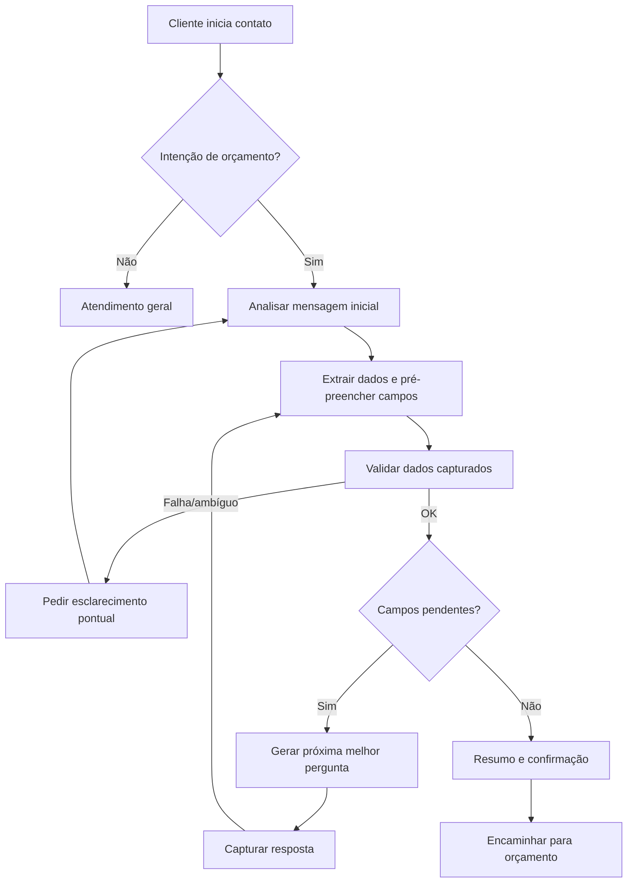

# REQ-002: Fluxo Conversacional Guiado

**Versão**: 1.14  
**Data**: 2026-05-08  
**Autor**: Kika (Analista de Requisitos)  
**Status**: Em Elaboração  
**Prioridade**: Alta  

---

## 1. Identificação do Requisito

**ID**: REQ-002  
**Tipo**: Funcional  
**Categoria**: UX/Conversação  
**Solicitante**: Rita (Inforrel)  

---

## 2. Descrição

O sistema deve conduzir conversas de forma estruturada, porém **adaptativa**, coletando informações essenciais do cliente a partir da análise do **primeiro contato** e das mensagens subsequentes. Em vez de seguir uma sequência fixa de perguntas, o sistema deve:

- Identificar a intenção do cliente (ex: orçamento de relógio, orçamento de catraca, controle de acesso)
- Extrair entidades e dados já informados (ex: CNPJ, endereço, modelo/tecnologia, quantidade)
- Determinar quais informações estão faltando para viabilizar o orçamento
- Fazer **apenas as próximas perguntas necessárias** (perguntas dinâmicas), na melhor ordem para aquele caso

---

## 3. Justificativa de Negócio

**Problema Atual**:
- Rita precisa fazer as mesmas perguntas repetidamente
- Processo manual e suscetível a esquecimentos
- Clientes podem não fornecer todas as informações necessárias

**Benefício Esperado**:
- Padronização da qualificação de leads
- Redução de tempo no atendimento
- Melhor experiência para o cliente
- Dados completos para elaboração de orçamentos

**Feedback da Rita**: "seria interessante se tivesse algumas perguntas. Ex: qual o CNPJ, após ele responder o sistema faz outra pergunta e assim vai."

---

## 4. Critérios de Aceite

### 4.1 Funcionalidades Obrigatórias

- [ ] **REQ-002.1 — Classificação e roteamento das mensagens do cliente**: Toda mensagem recebida do cliente deve passar por um classificador que decide qual fluxo deve tratá-la. O sistema deve identificar uma de quatro categorias e direcionar a mensagem para o requisito correspondente:
  - **Intenção de compra/orçamento (mensagem inicial)** → ativa o modo de qualificação no **REQ-002** e segue para a primeira pergunta dinâmica
  - **Resposta a pergunta de qualificação em curso** → tratada pelo **REQ-002** (captura no campo correspondente)
  - **Pergunta sobre produto/serviço/empresa** → delegada ao **REQ-003** (consulta à base de respostas automáticas / RAG)
  - **Pedido de atendimento humano ou situação crítica** → delegada ao **REQ-004** (escalonamento para humano)

  Este requisito é a **porta de entrada** do sistema: nenhuma mensagem do cliente deve ser processada sem antes passar por essa classificação. As regras específicas de cada fluxo (REQ-002.17, REQ-003.1, REQ-004.1) descrevem **o que fazer após** o roteamento.

- [ ] **REQ-002.2 — Identificar dados iniciais do cliente e armazená-los**: Sistema deve analisar a mensagem inicial e **pré-preencher** os dados já fornecidos pelo cliente (quando identificáveis)

- [ ] **REQ-002.3 — Controle de estado dos campos de qualificação**: Sistema deve manter um conjunto de informações necessárias para orçamento (campos) e marcar cada campo como:
  - Capturado
  - Pendente
  - Não aplicável

- [ ] **REQ-002.3A — Identificar tipo de produto/serviço solicitado pelo cliente**: Sistema deve identificar, logo após a intenção ser detectada (REQ-002.1), qual o **tipo de produto/serviço** que o cliente está solicitando, entre as categorias atendidas pela Inforrel:
  - Relógio de ponto (controle de ponto)
  - Catraca / controle de acesso
  - Câmeras / CFTV
  - Roteadores
  - Softwares
  - Cancelas
  - Assistência técnica
  - Outro / não identificado

  Quando o tipo não estiver claro na mensagem inicial, o sistema deve fazer uma pergunta direta para classificar antes de prosseguir com a qualificação dos demais campos. O tipo identificado direciona as próximas perguntas dinâmicas (REQ-002.4) e as regras específicas por produto (REQ-002.14, REQ-002.14A).

- [ ] **REQ-002.3B — Identificar modelo do produto**: Após identificar o tipo (REQ-002.3A), o sistema deve identificar o **modelo específico** do produto solicitado. Exemplos por tipo:
  - **Catraca**: Fit, Box, Pedestal, Giratória, Cancela, etc.
  - **Relógio de ponto**: cartográfico ou eletrônico, este último com tecnologia (cartão de proximidade, cartão de barras, biometria, reconhecimento facial)
  - **Câmeras / CFTV, Roteadores, Softwares, Cancelas, Assistência técnica**: modelo/especificação conforme catálogo Inforrel

  Quando o modelo não estiver claro, o sistema deve perguntar diretamente, oferecendo a lista de opções válidas para o tipo de produto correspondente.

- [ ] **REQ-002.3C — Coletar informações adicionais para orçamento**: O sistema deve coletar os dados complementares que não pertencem nem ao tipo/modelo nem ao endereço de entrega:
  - Quantidade ou faixa de pessoas (funcionários/usuários)
  - Software de controle existente (controle de ponto ou controle de acesso), quando aplicável — quando o cliente mencionar um software, o sistema deve capturar o nome e, se necessário, pedir confirmação
  - Contato para envio do orçamento (e-mail e/ou telefone)

  Esta etapa aciona as regras específicas REQ-002.14 (faixa de funcionários em controle de ponto sem software), REQ-002.14A (quantidade de equipamentos em controle de acesso sem software) e REQ-002.15 (quantidade opcional para catraca com software existente). A flexibilidade de formato da quantidade/faixa é tratada pela validação em REQ-002.6.

- [ ] **REQ-002.3D — Coletar informações de endereço de entrega/instalação**: O sistema deve coletar o endereço completo onde o produto será entregue ou instalado:
  - Logradouro, número, complemento, bairro
  - Cidade, UF, CEP
  - Indicador se a operação é de instalação no local, apenas entrega ou retirada

  Quando o endereço vier preenchido em parte pela mensagem inicial (REQ-002.2), o sistema deve solicitar apenas os elementos faltantes.

- [ ] **REQ-002.4 — Mecanismo geral de definição de perguntas dinâmicas**: Sistema deve solicitar **apenas** os campos pendentes (perguntas dinâmicas), podendo alterar a ordem conforme o contexto

- [ ] **REQ-002.5 — Sumarização de dados de orçamento**: Visão consolidada dos campos coletados pelas etapas REQ-002.2, REQ-002.3A, REQ-002.3B, REQ-002.3C e REQ-002.3D. O sistema só deve considerar a qualificação concluída quando todos os campos abaixo estiverem capturados ou marcados como não aplicáveis:
  - CNPJ (integrado com REQ-001) — capturado em REQ-002.2
  - Tipo de produto/serviço — capturado em REQ-002.3A
  - Modelo/especificação do produto — capturado em REQ-002.3B
  - Quantidade/faixa de pessoas (obrigatória para controle de ponto e controle de acesso) — capturado em REQ-002.3C
  - Software existente (se aplicável) — capturado em REQ-002.3C
  - Contato para orçamento — capturado em REQ-002.3C
  - Endereço de entrega/instalação — capturado em REQ-002.3D

- [ ] **REQ-002.6 — Validação de respostas capturadas**: Sistema deve validar cada resposta capturada antes de considerar o campo como completo:
  - Formato de CNPJ
  - Modelo de produto válido
  - Endereço completo
  - E-mail/telefone válidos
  - Quantidade/faixa de pessoas: aceita número exato ou faixa/aproximação (ex: “até 50”, “51-100”, “100+”), desde que permita dimensionamento

### 4.2 Regras de Negócio

- [ ] **REQ-002.10 — Reuso de CNPJ já validado**: Se cliente já tiver CNPJ validado (REQ-001), sistema não deve pedir CNPJ novamente, a menos que haja conflito de dados, como:
  - Cliente informar um CNPJ diferente em mensagem posterior (retificação)
  - Cliente solicitar explicitamente troca (ex: matriz vs filial)
  - CNPJ consultado retornar dados que contradizem fortemente o contexto informado (ex: cliente afirma ser Empresa X, mas o CNPJ retorna outra razão social)
  Nesses casos, o sistema deve fazer uma confirmação pontual (ex: “Você mencionou dois CNPJs diferentes. Qual devo usar para o orçamento?”)

- [ ] **REQ-002.14 — Faixa de funcionários em controle de ponto sem software**: Para controle de ponto (relógio de ponto), se o cliente não tiver software de controle de ponto, o sistema deve solicitar a faixa de funcionários (resposta obrigatória) para concluir a qualificação

- [ ] **REQ-002.14A — Quantidade de equipamentos em controle de acesso sem software**: Para controle de acesso (catracas), se o cliente não tiver software de controle de acesso, o sistema deve solicitar a quantidade de equipamentos (resposta obrigatória) para concluir a qualificação

- [ ] **REQ-002.15 — Quantidade opcional para catraca com software existente**: Para catracas, se o cliente já tiver software de controle de acesso, a quantidade/faixa de pessoas pode ser tratada como opcional; se o cliente não souber ou não quiser informar, o sistema deve seguir o fluxo e solicitar apenas os demais campos pendentes

- [ ] **REQ-002.16 — Confirmação dos dados extraídos da mensagem inicial**: Quando o sistema extrair um ou mais dados da mensagem inicial do cliente (REQ-002.2), antes de prosseguir com a próxima pergunta dinâmica deve **ecoar ao cliente os dados entendidos** para que ele possa corrigir, se necessário

- [ ] **REQ-002.17 — Consulta à base de respostas automáticas durante a qualificação**: Durante o fluxo de qualificação, se o cliente enviar uma **pergunta sobre produto/serviço** (ex: características técnicas, compatibilidade, preço, prazos, catálogo, serviços prestados), o sistema deve:
  - Delegar a resposta ao REQ-003 (Base de Conhecimento / RAG)
  - Após responder a dúvida, **retomar a qualificação** no ponto em que estava, reapresentando a última pergunta pendente
  - Não descartar os dados já capturados

### 4.3 Requisitos Não-Funcionais

- [ ] **REQ-002.19 — Tempo de resposta entre perguntas**: Tempo de resposta entre perguntas: < 2 segundos
- [ ] **REQ-002.20 — Naturalidade da conversa**: Conversa deve parecer natural, não robótica
- [ ] **REQ-002.21 — Tratamento de respostas ambíguas**: Sistema deve lidar com respostas ambíguas

### 4.4 Terminologia

Para evitar ambiguidade, este requisito adota a seguinte terminologia:

- **Pergunta de qualificação**: pergunta feita pelo **sistema** para coletar um dado necessário ao orçamento (ex: "Qual o CNPJ?", "Quantos funcionários vão bater ponto?", "Catraca pedestal, giratória ou cancela?"). Sempre tratada pelo REQ-002.
- **Resposta de qualificação**: mensagem do **cliente** respondendo a uma pergunta de qualificação. Captura em campo (ver REQ-002.3).
- **Pergunta sobre produto/serviço**: mensagem do **cliente** com dúvida que exige consulta à base de conhecimento (catálogo, FAQ, manuais, preços, prazos, compatibilidade, serviços). Delegada ao REQ-003.
- **Mensagem de escalonamento**: pedido explícito de atendimento humano ou sinal de situação crítica. Delegada ao REQ-004.

---

## 5. Fluxograma da Conversa



---

## 6. Exemplos de Fluxo

### 6.1 Fluxo Completo - Relógio de Ponto

```
Cliente: "Olá, preciso de orçamento de relógio de ponto biométrico para 50 funcionários. Meu CNPJ é 12.345.678/0001-90. Entrega em São Paulo/SP."

Sistema: "Entendi! Vou preparar seu orçamento.
✅ Empresa identificada: RAZÃO SOCIAL LTDA
✅ Produto: Relógio de ponto biométrico
✅ Local: São Paulo/SP

Falta só confirmar:
1) Endereço completo (rua, número e bairro)
2) Um e-mail para envio do orçamento

Pode me passar o endereço completo?"

Cliente: "Rua Exemplo, 123 - Centro - São Paulo/SP"

Sistema: "Perfeito. E qual e-mail posso usar para te enviar o orçamento?"

Cliente: "contato@empresa.com"

Sistema: "Resumo do seu pedido:
- Empresa: RAZÃO SOCIAL LTDA
- Produto: Relógio de ponto biométrico
- Entrega: Rua Exemplo, 123 - Centro - São Paulo/SP
- Funcionários: 50
- Contato: contato@empresa.com

Posso encaminhar para elaboração do orçamento? (S/N)"
```

### 6.2 Tratamento de Exceções

```
Cliente: "Quero um orçamento de catraca para academia"

Sistema: "Claro! Só para eu direcionar certinho: você quer catraca de que tipo?
1. Pedestal
2. Giratória
3. Cancela"
```

### 6.3 Interação entre REQ-002 e REQ-003 (qualificação intercalada com dúvidas)

Durante a qualificação, o cliente pode fazer perguntas sobre produto/serviço que saem do roteiro. O sistema deve responder via RAG (REQ-003) e depois **retomar** a qualificação de onde parou:

```
Cliente: "Oi, preciso de orçamento de relógio de ponto para 80 funcionários."
  → REQ-002 captura: produto=relógio de ponto, faixa de funcionários≈80

Sistema: "Perfeito! Sua empresa já tem software de controle de ponto?"
  → Pergunta de qualificação (REQ-002)

Cliente: "Ainda não. Aliás, qual a diferença entre biométrico e facial?"
  → Pergunta sobre produto/serviço (delegada ao REQ-003)

Sistema: "Boa pergunta! O biométrico identifica pela digital do dedo,
enquanto o facial reconhece pelo rosto — mais rápido e sem contato.
[resposta gerada via RAG sobre catálogo Inforrel]

Voltando ao seu orçamento: você prefere biométrico ou facial?"
  → REQ-002 retoma a qualificação no ponto em que estava

Cliente: "Facial."
  → REQ-002 captura: tecnologia=facial
```

---

## 7. Dependências

### 7.1 Dependências Técnicas
- REQ-001: Integração Receita Federal
- Motor de IA para processamento de respostas
- Sistema de validação de dados

### 7.2 Dependências de Negócio
- Definição dos modelos de produtos
- Lista de softwares homologados
- Critérios de dimensionamento

---

## 8. Restrições e Limitações

### 8.1 Restrições
- Cliente pode abandonar conversa a qualquer momento
- Respostas podem ser ambíguas ou incompletas
- Necessário manter contexto da conversa

### 8.2 Limitações Aceitas no POC
- [ ] Sem persistência de conversas abandonadas
- [ ] Sem correção de dados após coleta
- [ ] Sem múltiplos produtos na mesma conversa

---

## 9. Critérios de Sucesso

### 9.1 Métricas
- Taxa de conclusão do fluxo: > 70%
- Redução de tempo de qualificação: > 40%
- Satisfação do cliente: > 4/5
- Completude dos dados coletados: > 90%

### 9.2 Condições de Aceite Final
- Rita aprova o fluxo conversacional
- Sistema coleta todos os dados necessários
- Clientes completam o fluxo sem dificuldades

---

## 10. Riscos e Mitigações

| Risco | Probabilidade | Impacto | Mitigação |
|-------|---------------|---------|-----------|
| Cliente abandona conversa | Média | Médio | Fazer perguntas curtas e pedir só o necessário |
| Extração incorreta de dados da mensagem inicial | Média | Médio | Confirmar entendimento em mensagens de resumo antes de avançar |
| Respostas ambíguas | Alta | Baixo | Perguntas de esclarecimento pontual e opções quando aplicável |
| Falha na validação | Baixa | Alto | Testes exaustivos |
| Conversa soa robótica | Média | Médio | Variação nas respostas |

---

## 11. Estimativas

| Atividade | Horas |
|-----------|-------|
| Design do fluxo conversacional | 3h |
| Implementação da lógica adaptativa (campos pendentes + próxima pergunta) | 6h |
| Validações de dados | 2h |
| Tratamento de exceções | 3h |
| Ajustes de UX de perguntas (sem exibir progresso) | 1h |
| Testes e ajustes | 3h |
| **Total** | **18h** |

---

## 12. Histórico de Alterações

| Data | Versão | Alteração | Autor |
|------|--------|-----------|-------|
| 14/04/2026 | 1.0 | Criação inicial do requisito | Kika |
| 15/04/2026 | 1.1 | Ajuste para qualificação adaptativa e perguntas dinâmicas | Kika |
| 24/04/2026 | 1.2 | Separação de REQ-002.14 em dois requisitos (controle de ponto e controle de acesso) com regras específicas para quando não há software existente | Kika |
| 05/05/2026 | 1.3 | Adicionada terminologia (seção 4.4), regras de interação com REQ-003 (REQ-002.17 e REQ-002.18) e exemplo 6.3 de qualificação intercalada com dúvidas sobre produto/serviço | Kika |
| 06/05/2026 | 1.4 | Adição de títulos descritivos a todos os requisitos; renumeração dos requisitos não-funcionais REQ-002.11/.12/.13 para REQ-002.19/.20/.21 (corrigindo conflito com IDs já usados em Regras de Negócio) | Kika |
| 06/05/2026 | 1.5 | Renomeação de REQ-002.1, REQ-002.2 e REQ-002.3 para refletir melhor as etapas da jornada; criação de novo REQ-002.3A sobre identificação do tipo de produto/serviço solicitado pelo cliente | Kika |
| 08/05/2026 | 1.6 | Estrutura híbrida de etapas: criação de REQ-002.3B (identificar modelo), REQ-002.3C (informações adicionais para orçamento) e REQ-002.3D (endereço de entrega/instalação); REQ-002.5 reescrito como visão consolidada referenciando as etapas | Kika |
| 08/05/2026 | 1.7 | Renomeação de REQ-002.4 ("Mecanismo geral de definição de perguntas dinâmicas") e REQ-002.5 ("Sumarização de dados de orçamento"); remoção do REQ-002.7 (redundante — comportamento já coberto pela combinação REQ-002.3 + REQ-002.4) | Kika |
| 08/05/2026 | 1.8 | Remoção de REQ-002.11, REQ-002.12 e REQ-002.13 (já embutidos em REQ-002.3B e REQ-002.3C); incorporação do detalhe "capturar nome do software e pedir confirmação se necessário" no REQ-002.3C; atualização de referências cruzadas em REQ-002.3A e REQ-002.3B | Kika |
| 08/05/2026 | 1.9 | Remoção do REQ-002.8 (parte 1 redundante com REQ-002.4; parte 2 "não exibir progresso" implicada por REQ-002.20 e pelo canal WhatsApp) | Kika |
| 08/05/2026 | 1.10 | Remoção do REQ-002.9 (implícito ao propósito do REQ-002 e já coberto por REQ-001.5); será retomado quando houver requisito específico de geração de orçamento | Kika |
| 08/05/2026 | 1.11 | Incorporação do REQ-002.15A no REQ-002.6 (validação de quantidade/faixa com formatos aceitos); remoção do REQ-002.15A; atualização de referências em REQ-002.3C | Kika |
| 08/05/2026 | 1.12 | Reescrita do REQ-002.16 para focar apenas no comportamento único de confirmação/eco dos dados extraídos (a parte "perguntar só o que falta" já está coberta por REQ-002.4) | Kika |
| 08/05/2026 | 1.13 | Reescrita do REQ-002.18 deixando explícito o papel de **roteador** entre REQ-002, REQ-003 e REQ-004 (porta de entrada do sistema); renomeação do REQ-002.17 para "Consulta à base de respostas automáticas durante a qualificação" | Kika |
| 08/05/2026 | 1.14 | Unificação de REQ-002.1 e REQ-002.18 no REQ-002.1 ("Classificação e roteamento das mensagens do cliente"), agora com quatro categorias incluindo "intenção de compra/orçamento (mensagem inicial)"; remoção do REQ-002.18 | Kika |

---

## 13. Aprovações

| Papel | Nome | Data | Assinatura |
|-------|------|------|------------|
| Analista de Requisitos | Kika | 14/04/2026 | [ ] |
| Cliente (Inforrel) | Rita | ____/____/____ | [ ] |
| Líder Técnico | Beto | ____/____/____ | [ ] |
