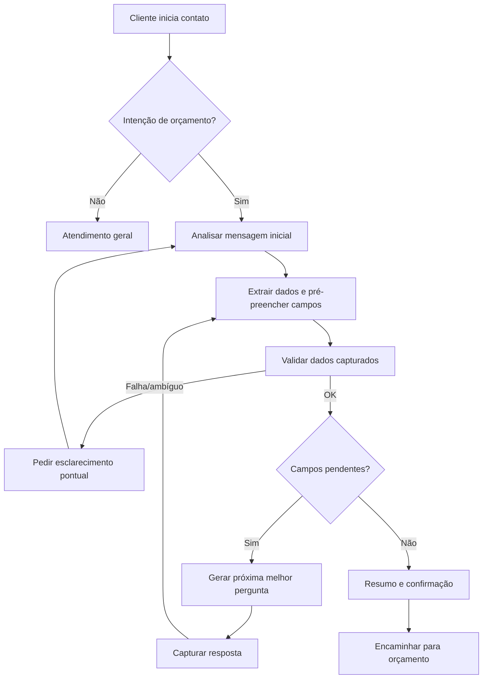

# REQ-002: Fluxo Conversacional Guiado

**Versão**: 1.1  
**Data**: 2026-04-15  
**Autor**: Kika (Analista de Requisitos)  
**Status**: Em Elaboração  
**Prioridade**: Alta  

---

## 1. Identificação do Requisito

**ID**: REQ-002  
**Tipo**: Funcional  
**Categoria**: UX/Conversação  
**Solicitante**: Rita (Inforrel)  

---

## 2. Descrição

O sistema deve conduzir conversas de forma estruturada, porém **adaptativa**, coletando informações essenciais do cliente a partir da análise do **primeiro contato** e das mensagens subsequentes. Em vez de seguir uma sequência fixa de perguntas, o sistema deve:

- Identificar a intenção do cliente (ex: orçamento de relógio, orçamento de catraca, controle de acesso)
- Extrair entidades e dados já informados (ex: CNPJ, endereço, modelo/tecnologia, quantidade)
- Determinar quais informações estão faltando para viabilizar o orçamento
- Fazer **apenas as próximas perguntas necessárias** (perguntas dinâmicas), na melhor ordem para aquele caso

---

## 3. Justificativa de Negócio

**Problema Atual**:
- Rita precisa fazer as mesmas perguntas repetidamente
- Processo manual e suscetível a esquecimentos
- Clientes podem não fornecer todas as informações necessárias

**Benefício Esperado**:
- Padronização da qualificação de leads
- Redução de tempo no atendimento
- Melhor experiência para o cliente
- Dados completos para elaboração de orçamentos

**Feedback da Rita**: "seria interessante se tivesse algumas perguntas. Ex: qual o CNPJ, após ele responder o sistema faz outra pergunta e assim vai."

---

## 4. Critérios de Aceite

### 4.1 Funcionalidades Obrigatórias

- [ ] **REQ-002.1**: Sistema deve identificar quando uma mensagem representa intenção de compra/orçamento e iniciar o modo de qualificação

- [ ] **REQ-002.2**: Sistema deve analisar a mensagem inicial e **pré-preencher** os dados já fornecidos pelo cliente (quando identificáveis)

- [ ] **REQ-002.3**: Sistema deve manter um conjunto de informações necessárias para orçamento (campos) e marcar cada campo como:
  - Capturado
  - Pendente
  - Não aplicável

- [ ] **REQ-002.4**: Sistema deve solicitar **apenas** os campos pendentes (perguntas dinâmicas), podendo alterar a ordem conforme o contexto

- [ ] **REQ-002.5**: Campos mínimos suportados pelo sistema:
  - CNPJ (integrado com REQ-001)
  - Tipo de produto (catraca ou relógio de ponto)
  - Modelo/especificação do produto
  - Endereço de entrega/instalação
  - Software existente (se aplicável)
  - Quantidade de funcionários (opcional; aceitar “não sei”)
  - Contato para orçamento

- [ ] **REQ-002.6**: Sistema deve validar cada resposta capturada antes de considerar o campo como completo:
  - Formato de CNPJ
  - Modelo de produto válido
  - Endereço completo
  - E-mail/telefone válidos

- [ ] **REQ-002.7**: Sistema deve formular perguntas apenas quando aplicáveis ao contexto, evitando solicitar informações não relevantes para o caso

- [ ] **REQ-002.8**: Sistema deve fazer apenas as perguntas importantes que ainda não foram respondidas, sem necessidade de apresentar progresso ao cliente

- [ ] **REQ-002.9**: Dados coletados devem ficar disponíveis para orçamento

### 4.2 Regras de Negócio

- [ ] **REQ-002.10**: Se cliente já tiver CNPJ validado (REQ-001), sistema não deve pedir CNPJ novamente, a menos que haja conflito de dados, como:
  - Cliente informar um CNPJ diferente em mensagem posterior (retificação)
  - Cliente solicitar explicitamente troca (ex: matriz vs filial)
  - CNPJ consultado retornar dados que contradizem fortemente o contexto informado (ex: cliente afirma ser Empresa X, mas o CNPJ retorna outra razão social)
  Nesses casos, o sistema deve fazer uma confirmação pontual (ex: “Você mencionou dois CNPJs diferentes. Qual devo usar para o orçamento?”)

- [ ] **REQ-002.11**: Para relógios de ponto, quando a tecnologia não estiver clara, sistema deve solicitar esclarecimento entre:
   - Cartão de proximidade
   - Cartão de barras
   - Biometria
   - Reconhecimento facial

- [ ] **REQ-002.12**: Para catracas, quando o tipo não estiver claro, sistema deve solicitar esclarecimento entre:
   - Pedestal
   - Giratória
   - Cancela

- [ ] **REQ-002.13**: Se cliente mencionar software existente, sistema deve capturar o nome do sistema e, se necessário, pedir confirmação

- [ ] **REQ-002.14**: Quantidade de funcionários pode ser solicitada independentemente do cliente ter ou não software, quando ajudar no dimensionamento e na elaboração do orçamento

- [ ] **REQ-002.15**: Quantidade de funcionários não deve ser tratada como obrigatória para concluir a qualificação; se o cliente não souber ou não quiser informar, o sistema deve seguir o fluxo e solicitar apenas os demais campos pendentes

- [ ] **REQ-002.16**: Se a mensagem inicial já contiver múltiplos dados (ex: CNPJ + produto + endereço), sistema deve responder confirmando o entendimento e perguntando somente o que faltar

### 4.3 Requisitos Não-Funcionais

- [ ] **REQ-002.11**: Tempo de resposta entre perguntas: < 2 segundos
- [ ] **REQ-002.12**: Conversa deve parecer natural, não robótica
- [ ] **REQ-002.13**: Sistema deve lidar com respostas ambíguas

---

## 5. Fluxograma da Conversa



---

## 6. Exemplos de Fluxo

### 6.1 Fluxo Completo - Relógio de Ponto

```
Cliente: "Olá, preciso de orçamento de relógio de ponto biométrico para 50 funcionários. Meu CNPJ é 12.345.678/0001-90. Entrega em São Paulo/SP."

Sistema: "Entendi! Vou preparar seu orçamento.
✅ Empresa identificada: RAZÃO SOCIAL LTDA
✅ Produto: Relógio de ponto biométrico
✅ Local: São Paulo/SP

Falta só confirmar:
1) Endereço completo (rua, número e bairro)
2) Um e-mail para envio do orçamento

Pode me passar o endereço completo?"

Cliente: "Rua Exemplo, 123 - Centro - São Paulo/SP"

Sistema: "Perfeito. E qual e-mail posso usar para te enviar o orçamento?"

Cliente: "contato@empresa.com"

Sistema: "Resumo do seu pedido:
- Empresa: RAZÃO SOCIAL LTDA
- Produto: Relógio de ponto biométrico
- Entrega: Rua Exemplo, 123 - Centro - São Paulo/SP
- Funcionários: 50
- Contato: contato@empresa.com

Posso encaminhar para elaboração do orçamento? (S/N)"
```

### 6.2 Tratamento de Exceções

```
Cliente: "Quero um orçamento de catraca para academia"

Sistema: "Claro! Só para eu direcionar certinho: você quer catraca de que tipo?
1. Pedestal
2. Giratória
3. Cancela"
```

---

## 7. Dependências

### 7.1 Dependências Técnicas
- REQ-001: Integração Receita Federal
- Motor de IA para processamento de respostas
- Sistema de validação de dados

### 7.2 Dependências de Negócio
- Definição dos modelos de produtos
- Lista de softwares homologados
- Critérios de dimensionamento

---

## 8. Restrições e Limitações

### 8.1 Restrições
- Cliente pode abandonar conversa a qualquer momento
- Respostas podem ser ambíguas ou incompletas
- Necessário manter contexto da conversa

### 8.2 Limitações Aceitas no POC
- [ ] Sem persistência de conversas abandonadas
- [ ] Sem correção de dados após coleta
- [ ] Sem múltiplos produtos na mesma conversa

---

## 9. Critérios de Sucesso

### 9.1 Métricas
- Taxa de conclusão do fluxo: > 70%
- Redução de tempo de qualificação: > 40%
- Satisfação do cliente: > 4/5
- Completude dos dados coletados: > 90%

### 9.2 Condições de Aceite Final
- Rita aprova o fluxo conversacional
- Sistema coleta todos os dados necessários
- Clientes completam o fluxo sem dificuldades

---

## 10. Riscos e Mitigações

| Risco | Probabilidade | Impacto | Mitigação |
|-------|---------------|---------|-----------|
| Cliente abandona conversa | Média | Médio | Fazer perguntas curtas e pedir só o necessário |
| Extração incorreta de dados da mensagem inicial | Média | Médio | Confirmar entendimento em mensagens de resumo antes de avançar |
| Respostas ambíguas | Alta | Baixo | Perguntas de esclarecimento pontual e opções quando aplicável |
| Falha na validação | Baixa | Alto | Testes exaustivos |
| Conversa soa robótica | Média | Médio | Variação nas respostas |

---

## 11. Estimativas

| Atividade | Horas |
|-----------|-------|
| Design do fluxo conversacional | 3h |
| Implementação da lógica adaptativa (campos pendentes + próxima pergunta) | 6h |
| Validações de dados | 2h |
| Tratamento de exceções | 3h |
| Ajustes de UX de perguntas (sem exibir progresso) | 1h |
| Testes e ajustes | 3h |
| **Total** | **18h** |

---

## 12. Histórico de Alterações

| Data | Versão | Alteração | Autor |
|------|--------|-----------|-------|
| 14/04/2026 | 1.0 | Criação inicial do requisito | Kika |
| 15/04/2026 | 1.1 | Ajuste para qualificação adaptativa e perguntas dinâmicas | Kika |

---

## 13. Aprovações

| Papel | Nome | Data | Assinatura |
|-------|------|------|------------|
| Analista de Requisitos | Kika | 14/04/2026 | [ ] |
| Cliente (Inforrel) | Rita | ____/____/____ | [ ] |
| Líder Técnico | Beto | ____/____/____ | [ ] |
