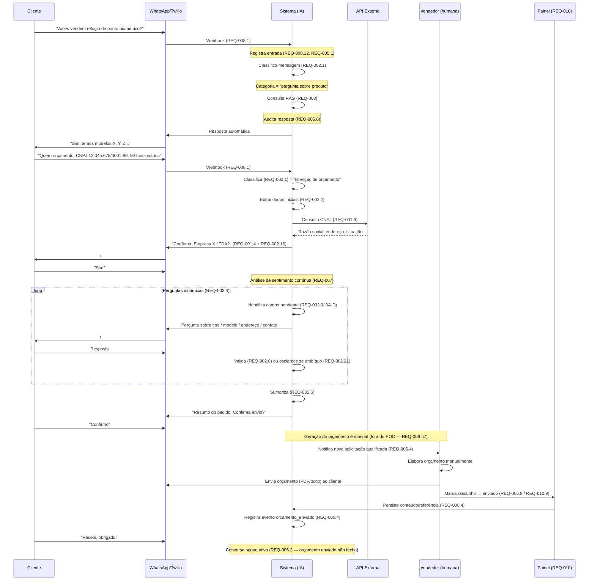

# Fluxo End-to-End — Sequência de REQs Disparados

**Versão**: 1.0
**Data**: 2026-05-13
**Autor**: Kika (Analista de Requisitos)
**Tipo**: Documento de visão (não é um REQ formal)
**Status**: Vivo — atualizar quando os REQs forem revisados

---

## Objetivo

Mostrar, em **um único cenário end-to-end**, como os requisitos `REQ-001` a `REQ-010` se conectam e em que **ordem** são disparados durante uma jornada típica do cliente — desde o primeiro "olá" no WhatsApp até o pós-envio do orçamento.

Útil para:

- Onboarding de novos integrantes do time
- Validação de cobertura: cada caso real deve achar seu lugar no fluxo
- Detecção de pontos cegos: regras que ninguém aciona em nenhum cenário
- Base para casos de teste end-to-end (consumido pelo `[qa]`)

---

## Cenário-base

> Cliente novo (não conhecido pelo sistema) inicia uma conversa no WhatsApp **perguntando sobre produto**, evolui para um **pedido de orçamento**, recebe o orçamento elaborado pelo vendedor e — em um momento posterior — entra em contato pós-venda.

---

## Visão geral em diagrama



---

## Sequência narrada por fase

### Fase 1 — Pergunta inicial sobre produto

| # | Acontece | REQ disparado |
|---|---|---|
| 1 | Cliente envia "Vocês vendem relógio de ponto biométrico?" | — |
| 2 | Twilio entrega via webhook | **REQ-008.1** (recepção) |
| 3 | Sistema deduplica e registra | **REQ-008.8**, **REQ-008.12**, **REQ-005.1** |
| 4 | Classificador roteia a mensagem | **REQ-002.1** → categoria "pergunta sobre produto" |
| 5 | RAG busca resposta na base | **REQ-003.1**, **REQ-003.2** |
| 6 | Sistema audita resposta da IA | **REQ-005.6** |
| 7 | Resposta enviada ao cliente | **REQ-008.4**, **REQ-005.2** |

### Fase 2 — Intenção de orçamento e qualificação

| # | Acontece | REQ disparado |
|---|---|---|
| 8 | Cliente envia "Quero orçamento, CNPJ X, 50 funcionários" | — |
| 9 | Classificador detecta intenção de orçamento | **REQ-002.1** |
| 10 | Estado da conversa transiciona para `Qualificação em andamento` | **REQ-005.3** |
| 11 | Sistema extrai dados da mensagem inicial | **REQ-002.2** |
| 12 | Reconhece CNPJ e consulta Receita Federal | **REQ-001.1**, **REQ-001.3** |
| 13 | Confirmação consolidada (CNPJ + demais campos) | **REQ-001.4** + **REQ-002.16** |
| 14 | Análise de sentimento monitora a conversa | **REQ-007.1** (contínuo) |

### Fase 3 — Perguntas dinâmicas

| # | Acontece | REQ disparado |
|---|---|---|
| 15 | Sistema identifica tipo de produto | **REQ-002.3A** |
| 16 | Identifica modelo específico | **REQ-002.3B** |
| 17 | Coleta info adicional (quantidade, software, contato) | **REQ-002.3C** + regras **REQ-002.14/.14A/.15** |
| 18 | Coleta endereço de entrega | **REQ-002.3D** |
| 19 | Cada resposta passa por validação | **REQ-002.6** |
| 20 | Se resposta ambígua, esclarecimento dirigido | **REQ-002.21** |
| 21 | Cliente pode interromper com nova pergunta sobre produto | **REQ-002.17** → **REQ-003** e retoma |
| 22 | Cliente some por 24h | **REQ-002.22** envia reengajamento |

### Fase 4 — Possíveis ramificações

| Situação | REQ disparado |
|---|---|
| Cliente pede "falar com humano" | **REQ-004.6** → escalonamento imediato |
| Sentimento negativo persistente | **REQ-007.2** → marca crítica → **REQ-004.7** |
| Análise técnica complexa (>=4 catracas, etc.) | **REQ-004.8** |
| RAG sem resposta confiável | **REQ-004.9** |
| Estado vai para `Em atendimento humano` | **REQ-004.4** + suspende automação **REQ-004.10** (aplicada em **REQ-008.14**) |

### Fase 5 — Sumarização e geração (manual)

| # | Acontece | REQ disparado |
|---|---|---|
| 23 | Sistema mostra resumo final ao cliente | **REQ-002.5** |
| 24 | Cliente confirma | — |
| 25 | Sistema notifica vendedor com contexto | **REQ-005.4** |
| 26 | **vendedor gera o orçamento manualmente** (fora do escopo POC) | **REQ-006 §7** (limitação POC) |
| 27 | vendedor envia o orçamento ao cliente (WhatsApp/e-mail) | — |

### Fase 6 — Rastreamento e pós-envio

| # | Acontece | REQ disparado |
|---|---|---|
| 28 | vendedor marca `rascunho` → `enviado` no painel | **REQ-010.9** + **REQ-006.8** |
| 29 | Sistema persiste conteúdo/referência do orçamento | **REQ-006.4** |
| 30 | Evento `orcamento_enviado` registrado | **REQ-005.4** |
| 31 | Conversa **continua ativa** (orçamento enviado não fecha) | **REQ-005.3** (observação) |
| 32 | Eventualmente vendedor marca `convertido`/`perdido` | **REQ-006.8**, **REQ-006.7** |

### Fase 7 — Pós-venda (cenário alternativo, dias depois)

| # | Acontece | REQ disparado |
|---|---|---|
| 33 | Cliente reclama "comprei e não chegou" | **REQ-009.1** detecta pós-venda |
| 34 | Marca conversa como crítica (pós-venda prevalece sobre REQ-004.7) | **REQ-009.2** + **REQ-007.2** |
| 35 | Identifica orçamento pelo telefone | **REQ-009.3** / **REQ-009.4** |
| 36 | Mostra resumo para confirmação (com data correta) | **REQ-009.6** |
| 37 | Cliente diz "não é esse" → tenta próximo | **REQ-009.7** |
| 38 | Escalona com contexto completo | **REQ-009.8** + **REQ-004.2** |
| 39 | Suspende respostas automáticas | **REQ-009.9** (= **REQ-004.10**) |

---

## Caminho crítico (ordem cronológica simplificada)

```
REQ-008.1 → REQ-005.1 → REQ-002.1 → [REQ-003 ou REQ-002.2]
  → REQ-001.3 → REQ-001.4 + REQ-002.16
  → REQ-002.3A → REQ-002.3B → REQ-002.3C → REQ-002.3D
  → REQ-002.6 (em cada resposta) + REQ-007 (contínuo)
  → REQ-002.5
  → [vendedor: geração manual — fora do POC]
  → REQ-010.9 + REQ-006.8 + REQ-006.4 + REQ-005.4
```

---

## Como manter este documento

- Ao **criar um novo REQ**, verificar se ele entra em alguma das fases acima e atualizar a tabela correspondente
- Ao **renumerar/remover** sub-requisitos referenciados aqui, atualizar este arquivo na mesma alteração
- Ao **mudar o escopo do POC** (ex: automatizar a geração do orçamento), revisar a Fase 5 e 6
- Cenários alternativos (escalonamento puro, abandono total, recusa de CNPJ) podem virar **arquivos irmãos**, ex: `fluxo_escalonamento_imediato.md`, `fluxo_abandono.md`

---

## Histórico de Alterações

| Data | Versão | Alteração | Autor |
|------|--------|-----------|-------|
| 13/05/2026 | 1.0 | Criação do fluxo end-to-end de referência cobrindo REQ-001 a REQ-010 (cenário: pergunta sobre produto → orçamento → pós-venda) | Kika |
