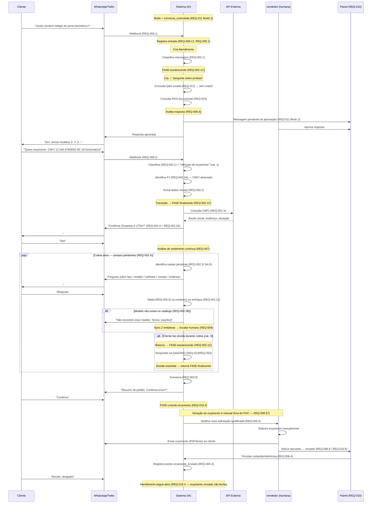

# Fluxo End-to-End — Sequência de REQs Disparados

**Versão**: 2.0
**Data**: 2026-07-16
**Autor**: Kika (Analista de Requisitos)
**Tipo**: Documento de visão (não é um REQ formal)
**Status**: Vivo — atualizar quando os REQs forem revisados

---

## Objetivo

Mostrar, em **um único cenário end-to-end**, como os requisitos `REQ-001` a `REQ-016` se conectam e em que **ordem** são disparados durante uma jornada típica do cliente — desde o primeiro "olá" no WhatsApp até o pós-envio do orçamento.

Útil para:

- Onboarding de novos integrantes do time
- Validação de cobertura: cada caso real deve achar seu lugar no fluxo
- Detecção de pontos cegos: regras que ninguém aciona em nenhum cenário
- Base para casos de teste end-to-end (consumido pelo `[qa]`)

---

## Cenário-base

> Cliente novo (PJ, não conhecido pelo sistema) inicia uma conversa no WhatsApp **perguntando sobre produto** (FASE-esclarecendo), evolui para um **pedido de orçamento** (transição para FASE-finalizando com coleta ativa de campos), recebe o orçamento elaborado pelo vendedor e — em um momento posterior — entra em contato pós-venda. O sistema opera em **modo conversa controlada** (REQ-011 Modo 2), com aprovação humana das respostas.

---

## Visão geral em diagrama



---

## Sequência narrada por fase

### Fase 1 — Pergunta inicial sobre produto (FASE-esclarecendo)

| # | Acontece | REQ disparado |
|---|---|---|
| 1 | Cliente envia "Vocês vendem relógio de ponto biométrico?" | — |
| 2 | Twilio entrega via webhook | **REQ-008.1** (recepção) |
| 3 | Sistema deduplica e registra | **REQ-008.8**, **REQ-008.12**, **REQ-005.1** |
| 4 | Sistema cria Atendimento #1 para o contato | **REQ-016.3** (criação automática) |
| 5 | Classificador roteia a mensagem | **REQ-002.1** → categoria "pergunta sobre produto" (cat. 3) |
| 6 | Motor de roteamento: Intenção×Fase → Ações (FASE-esclarecendo) | **REQ-002.1C** |
| 7 | Busca na Q&A curada (camada prioritária) | **REQ-013.1** → sem match |
| 8 | RAG documental busca resposta | **REQ-003.1**, **REQ-003.2** |
| 9 | Sistema audita resposta da IA | **REQ-005.6** |
| 10 | Resposta fica pendente de aprovação (Modo 2) | **REQ-011.5** (conversa controlada) |
| 11 | Vendedor aprova no painel | **REQ-011.6**, **REQ-010** |
| 12 | Resposta enviada ao cliente | **REQ-008.4**, **REQ-005.2** |

### Fase 2 — Intenção de orçamento e transição para coleta (FASE-esclarecendo → FASE-finalizando)

| # | Acontece | REQ disparado |
|---|---|---|
| 13 | Cliente envia "Quero orçamento, CNPJ X, 50 funcionários" | — |
| 14 | Classificador detecta intenção de orçamento (cat. 1) | **REQ-002.1** |
| 15 | Sistema identifica tipo de cliente: PJ (CNPJ detectado) | **REQ-002.2A** |
| 16 | Sistema extrai dados da mensagem inicial | **REQ-002.2** |
| 17 | Transição FASE-esclarecendo → FASE-finalizando (intenção + tipo produto + sem dúvida) | **REQ-002.1C** |
| 18 | Reconhece CNPJ e consulta Receita Federal | **REQ-001.1**, **REQ-001.3** |
| 19 | Confirmação consolidada (CNPJ + demais campos extraídos) | **REQ-001.4** + **REQ-002.16** |
| 20 | Análise de sentimento monitora a conversa | **REQ-007.1** (contínuo) |

> **Variante PF**: se o cliente informar CPF ou termos como "pessoa física" (REQ-002.2A), o fluxo segue **REQ-015** em vez de REQ-001: validação de CPF (REQ-015.1–.3), consulta de débitos (REQ-015.5) e sinalização ao vendedor (REQ-015.7). O nome do solicitante é obrigatório (REQ-002.3C).

### Fase 3 — Coleta ativa de campos (FASE-finalizando)

| # | Acontece | REQ disparado |
|---|---|---|
| 21 | Sistema identifica tipo de produto (se não detectado antes) | **REQ-002.3A** |
| 22 | Pergunta modelo específico (`CAMPO-modelo`) | **REQ-002.3B** |
| 23 | Se modelo não existe no catálogo → informa e reapresenta opções | **REQ-002.3B** (nunca armazena texto livre) |
| 24 | Se modelo sem correspondência após 2 tentativas → escala | **REQ-004** (escalonamento por modelo) |
| 25 | Coleta info adicional: software (`CAMPO-software-ponto`), faixa funcionários (`CAMPO-faixa-funcionarios`), contato (`CAMPO-contato`) | **REQ-002.3C** + regras **REQ-002.14/.14A/.15** |
| 26 | Coleta endereço de entrega (`CAMPO-endereco`) | **REQ-002.3D** |
| 27 | Cada resposta passa por validação | **REQ-002.6** |
| 28 | Se resposta ambígua, esclarecimento dirigido | **REQ-002.21** |
| 29 | Cliente faz dúvida durante coleta → retorno FASE-esclarecendo | **REQ-002.1C** → **REQ-013**/**REQ-003** → retoma FASE-finalizando |
| 30 | Cliente some por tempo parametrizável | **REQ-002.22** envia reengajamento (**REQ-014.2D** define tempos) |

### Fase 4 — Possíveis ramificações (qualquer momento)

| Situação | REQ disparado |
|---|---|
| Cliente pede "falar com humano" | **REQ-004.6** → escalonamento imediato |
| Sentimento negativo persistente | **REQ-007.2** → marca crítica → **REQ-004.7** |
| Análise técnica complexa (>=4 catracas, etc.) | **REQ-004.8** |
| RAG sem resposta confiável | **REQ-004.9** |
| Modelo sem correspondência após 2 tentativas | **REQ-002.3B** → **REQ-004** (escalonamento por modelo) |
| Atendimento vai para `modo_operacao = HUMANO` | **REQ-004.4** + suspende automação **REQ-004.10** (aplicada em **REQ-008.14**) |
| Vendedor reprova resposta da IA (Modo 2) | **REQ-011.7** → cria report **REQ-012.2** |
| Vendedor edita resposta antes de aprovar | **REQ-011.15** → report automático **REQ-012.2A** |
| Vendedor assume conversa manualmente | **REQ-004.3** (takeover iniciado pelo vendedor) |

### Fase 5 — Sumarização e handoff (FASE-finalizando → FASE-criando-orcamento)

| # | Acontece | REQ disparado |
|---|---|---|
| 31 | Sistema mostra resumo final ao cliente (todos os campos capturados) | **REQ-002.5** |
| 32 | Cliente confirma | — |
| 33 | Transição → FASE-criando-orcamento (`modo_operacao = HUMANO`) | **REQ-016.4** |
| 34 | Sistema notifica vendedor com contexto | **REQ-005.4** |
| 35 | **Vendedor gera o orçamento manualmente** (fora do escopo POC) | **REQ-006 §7** (limitação POC) |
| 36 | Vendedor envia o orçamento ao cliente (WhatsApp/e-mail) | — |

### Fase 6 — Rastreamento e pós-envio

| # | Acontece | REQ disparado |
|---|---|---|
| 37 | Vendedor marca `rascunho` → `enviado` no painel | **REQ-010.9** + **REQ-006.8** |
| 38 | Sistema persiste conteúdo/referência do orçamento | **REQ-006.4** |
| 39 | Evento `orcamento_enviado` registrado | **REQ-005.4** |
| 40 | Atendimento **continua ativo** (orçamento enviado não fecha) | **REQ-016.4** |
| 41 | Painel exibe fase atual e campos pendentes do atendimento | **REQ-010.7B** |
| 42 | Eventualmente vendedor marca `convertido`/`perdido` | **REQ-006.8**, **REQ-006.7** |

### Fase 7 — Pós-venda (cenário alternativo, dias depois)

| # | Acontece | REQ disparado |
|---|---|---|
| 43 | Cliente reclama "comprei e não chegou" | **REQ-009.1** detecta pós-venda |
| 44 | Sistema pergunta se é continuação ou novo atendimento | **REQ-016.9** (PERG-016-009) |
| 45 | Marca conversa como crítica (pós-venda prevalece sobre REQ-004.7) | **REQ-009.2** + **REQ-007.2** |
| 46 | Identifica orçamento pelo telefone | **REQ-009.3** / **REQ-009.4** |
| 47 | Mostra resumo para confirmação (com data correta) | **REQ-009.6** |
| 48 | Cliente diz "não é esse" → tenta próximo | **REQ-009.7** |
| 49 | Escalona com contexto completo | **REQ-009.8** + **REQ-004.2** |
| 50 | Suspende respostas automáticas | **REQ-009.9** (= **REQ-004.10**) |

### Camadas transversais (atuam durante todo o fluxo)

| Camada | REQ | Papel no fluxo |
|--------|-----|----------------|
| Modo de operação | **REQ-011** | Define se respostas passam por aprovação (Modo 2) ou vão direto (Modo 3). No POC, opera em Modo 1 (simulação) ou Modo 2 (conversa controlada) |
| Reports de problema | **REQ-012** | Captura defeitos do agente (reprovações do REQ-011, observações avulsas). Alimenta evolução do cérebro |
| Q&A curada | **REQ-013** | Camada prioritária sobre o RAG: respostas pré-aprovadas para perguntas sensíveis. Consultada antes do RAG documental em toda interação |
| Configuração runtime | **REQ-014** | Ajuste de thresholds de similaridade, top-K, toggles `enabled` das camadas Q&A e RAG sem reiniciar o servidor |
| Atendimento | **REQ-016** | Agrupador conversacional: cria numeração sequencial por cliente, controla ciclo de vida (fases), separa conversa de desfecho comercial |
| Painel administrativo | **REQ-010** | Visibilidade operacional: atendimentos, mensagens pendentes, aprovações, reports, fase atual, campos pendentes (**REQ-010.7B**) |

---

## Caminho crítico (ordem cronológica simplificada)

```
REQ-008.1 → REQ-005.1 → REQ-016.3 (cria atendimento)
  → REQ-002.1 → REQ-002.1C (FASE-esclarecendo)
  → [REQ-013 → REQ-003 ou REQ-002.2]
  → REQ-002.2A (PJ/PF) → [REQ-001.3 (PJ) ou REQ-015 (PF)]
  → REQ-002.1C (transição → FASE-finalizando)
  → REQ-002.3A → REQ-002.3B → REQ-002.3C → REQ-002.3D
  → REQ-002.6 (em cada resposta) + REQ-007 (contínuo)
  → REQ-002.5 (resumo) → REQ-016.4 (FASE-criando-orcamento)
  → [vendedor: geração manual — fora do POC]
  → REQ-010.9 + REQ-006.8 + REQ-006.4 + REQ-005.4
  ‖ REQ-011 (modo de operação — transversal a toda resposta)
  ‖ REQ-012 (reports — a cada reprovação/edição)
  ‖ REQ-014 (config runtime — thresholds/toggles)
```

---

## Como manter este documento

- Ao **criar um novo REQ**, verificar se ele entra em alguma das fases acima e atualizar a tabela correspondente
- Ao **renumerar/remover** sub-requisitos referenciados aqui, atualizar este arquivo na mesma alteração
- Ao **mudar o escopo do POC** (ex: automatizar a geração do orçamento), revisar a Fase 5 e 6
- Cenários alternativos (escalonamento puro, abandono total, recusa de CNPJ) podem virar **arquivos irmãos**, ex: `fluxo_escalonamento_imediato.md`, `fluxo_abandono.md`

---

## Histórico de Alterações

| Data | Versão | Alteração | Autor |
|------|--------|-----------|-------|
| 13/05/2026 | 1.0 | Criação do fluxo end-to-end de referência cobrindo REQ-001 a REQ-010 (cenário: pergunta sobre produto → orçamento → pós-venda) | Kika |
| 16/07/2026 | 2.0 | Revisão completa: (1) cobertura ampliada para REQ-001 a REQ-016; (2) fases Esclarecendo/Finalizando/Criando-orçamento (REQ-002.1C); (3) PF/PJ com REQ-002.2A e REQ-015; (4) atendimento como agrupador (REQ-016); (5) modo de operação e aprovação (REQ-011); (6) reports (REQ-012), Q&A curada (REQ-013), config runtime (REQ-014); (7) modelo não reconhecido → escalar (REQ-002.3B); (8) camadas transversais; (9) diagrama mermaid atualizado | Cascade |
