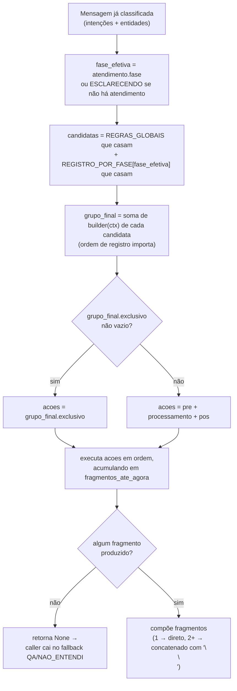
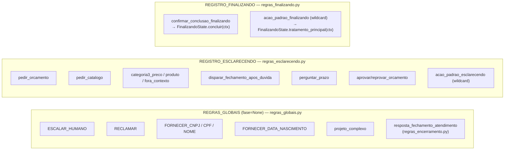

# Arquitetura do Motor de Roteamento Intenção×Fase→Ações — julho/2026

Documento técnico do motor que decide **o que fazer** a cada mensagem recebida, em
`backend/services/conversacao/`. Não confundir com o catálogo de negócio em
`artefatos/analista_de_requisitos/catalogo_conversacao/` (que descreve Fases/Campos/
Perguntas do ponto de vista de requisitos) — este documento explica a **implementação**
do motor de código que executa aquele catálogo.

## 1. Por que este motor existe

Antes do MVP Continuidade (jul/2026), o roteamento era "a primeira intenção que bater
vence": se uma mensagem batesse em duas intenções (ex.: uma saudação e uma pergunta de
produto na mesma frase), só a de maior prioridade era respondida — a outra era descartada
silenciosamente. Isso causava bugs de perda de conteúdo (ex.: saudação "engolindo" uma
pergunta de produto, ou um pedido de orçamento "engolindo" uma dúvida de preço).

O motor substitui essa lógica por: **toda intenção que bater é coletada**, cada par
(Intenção, Fase-do-atendimento) pode contribuir Ações, e o motor mescla e executa essas
Ações de forma determinística. Ver [[project_motor_intencao_fase_acoes]] (memória) para o
histórico da decisão.

**Atualização (mesmo mês):** um code review identificou que o "motor" acima decide bem *se*
uma Ação dispara, mas o *comportamento* de cada Fase (o que a Ação faz de fato) ainda morava
em `ProcessadorMensagem` — violação de GRASP Information Expert (Bloated Controller). A
§7 documenta a camada `estados/` que corrige isso, mantendo o motor descrito acima
intacto.

## 2. Vocabulário / peças do motor

| Peça | Módulo | Papel |
|---|---|---|
| `RegraIntencao` | `motor.py` | Item de registro: liga `(Intencao \| None, FaseAtendimento \| None)` a um `builder` que produz Ações. |
| `ContextoAcao` | `acoes.py` | Tudo que uma Ação pode precisar: `db`, `telefone`, `conteudo`, identificação, classificação, `atendimento`, e `fragmentos_ate_agora` (o que já foi respondido nesta mensagem, antes desta Ação rodar). |
| `Acao` | `acoes.py` | Unidade executável: `nome` (auditoria/debug) + corrotina `executar(ctx) -> RespostaFragmento`. |
| `TipoExecucao` / `GrupoAcoes` | `acoes.py` | 4 grupos que toda Regra devolve: `pre`, `processamento`, `pos`, `exclusivo`. |
| `resolver_e_executar` | `motor.py` | O "gerenciador": coleta as Regras cujo (intenção, fase) casam, mescla os 4 grupos de todas elas, e executa. |

### `RegraIntencao.intencao` e `.fase` — os dois coringas

- `intencao=None` → **wildcard**: a Regra sempre casa, independente de qual intenção bateu.
  É como toda "ação padrão" de uma Fase é implementada (ex.: `acao_padrao_esclarecendo`,
  `acao_padrao_finalizando`) — o comportamento de fallback daquela fase quando nenhuma
  Regra mais específica tratou nada.
- `fase=None` → **regra global**: avaliada em qualquer Fase efetiva do atendimento, antes
  das regras específicas da fase (ver `REGRAS_GLOBAIS` em `regras_globais.py`:
  `ESCALAR_HUMANO`, `RECLAMAR`, `FORNECER_CNPJ`/`CPF`/`NOME`, projeto complexo, e a
  interpretação da pergunta de fechamento de `regras_encerramento.py`).

### Os 4 grupos de execução (`TipoExecucao`)

```
EXCLUSIVO   → se não vazio, SÓ ele roda (ignora pre/processamento/pos por completo)
PRE         → roda antes, tipicamente efeitos colaterais silenciosos (ex.: gravar nome)
PROCESSAMENTO → reservado para o corpo principal (pouco usado hoje — a maioria das
                Ações de resposta visível usa POS)
POS         → roda por último, tipicamente o que gera texto de resposta
```

`EXCLUSIVO` generaliza casos que antes eram tratamento especial no roteador (ex.:
escalonamento humano) como "só mais uma Ação", sem `if` especial no dispatcher.

## 3. Fluxo de `resolver_e_executar`



Pontos que não são óbvios lendo qualquer arquivo isolado:

1. **Ordem de registro dentro de uma lista importa.** Regras mais específicas devem
   aparecer **antes** do wildcard da fase na lista Python — a "ação padrão" olha
   `ctx.fragmentos_ate_agora` para decidir se ainda precisa agir, e só reflete o que rodou
   antes dela na mesma lista.
2. **Globais rodam antes das específicas da fase**, sempre — mesmo que a intenção também
   tivesse uma Regra na fase atual.
3. **`fragmentos_ate_agora` é o mecanismo de coordenação entre Ações da mesma mensagem.**
   Não há um "orquestrador" central decidindo qual Ação deve ceder para qual — cada builder
   decide sozinho, olhando esse acumulador (ex.: `_builder_categoria3` não contribui nada
   se `PEDIR_ORCAMENTO` já respondeu algo antes na mesma mensagem).
4. **Uma Ação pode devolver 3 formatos** (`RespostaFragmento` em `acoes.py`): uma tupla
   `(MensagemId, contexto)` pronta pro catálogo de templates, uma `RespostaGerada` já
   pronta (vinda de RAG/QA/LLM), ou `None` (efeito colateral puro, ex.: gravar nome —
   não produz texto).
5. **`EXCLUSIVO` derrota tudo.** Se qualquer Regra candidata contribuir uma Ação exclusiva,
   nenhuma Ação de `pre`/`processamento`/`pos` roda naquele turno — mesmo que várias
   Regras diferentes tenham casado.

## 4. Onde cada Regra é registrada



A ligação entre esses registros e `resolver_e_executar` é feita em
`services/processador.py`:

```python
REGISTRO_POR_FASE = {
    FaseAtendimento.ESCLARECENDO: REGISTRO_ESCLARECENDO,
    FaseAtendimento.FINALIZANDO: REGISTRO_FINALIZANDO,
}
...
resposta = await resolver_e_executar(ctx, REGRAS_GLOBAIS, REGISTRO_POR_FASE)
```

`FaseAtendimento.EM_ORCAMENTACAO` **não tem entrada** em `REGISTRO_POR_FASE` — não é um
esquecimento: ao transicionar para essa fase (`FinalizandoState.concluir`), o
`modo_operacao` já vira `HUMANO` na mesma operação, e o nível acima
(`ProcessadorMensagem.processar()`) já suprime toda geração de resposta automática nesse
modo antes mesmo de chegar em `_decidir_resposta`/`resolver_e_executar`.

### Cada arquivo de Regras em uma frase

- **`regras_globais.py`** — intenções que fazem sentido em qualquer fase (escalonamento,
  reclamação, fornecimento de documento/nome). Wrappers finos sobre helpers de
  `ProcessadorMensagem` já existentes — nenhuma lógica de negócio nova aqui.
- **`regras_esclarecendo.py`** — fase inicial, antes de haver um pedido de orçamento
  qualificado. Unifica o dispatch que antes variava por `StatusIdentificacao`
  (NOVO/SEM_EMPRESA/identificado): hoje todo contato em Esclarecendo reconhece as mesmas
  intenções. A "ação padrão" (`acao_padrao_esclarecendo`) delega para
  `EsclarecendoState.tratamento_principal` (§7) — é a peça central do bug histórico que
  motivou o motor, só age se nada mais respondeu nada.
- **`regras_finalizando.py`** — fase de coleta ativa de dados do orçamento. O desfecho
  (confirmação do resumo → handoff pra humano) e a ação padrão (loop F1-F4: captura solta,
  resolução de modelo, dúvida com retomada, resumo) são ambos Regras finas que delegam para
  `FinalizandoState` (§7) — este arquivo só decide *se*/*quando* cada uma dispara.
- **`regras_encerramento.py`** — regra global (não amarrada a nenhuma fase específica) que
  interpreta a resposta do cliente à pergunta de fechamento ("posso ajudar em mais alguma
  coisa?"), dispatrada de dentro de `regras_esclarecendo.py`. Resposta negativa encerra o
  atendimento; qualquer outra coisa só limpa o sinalizador e deixa o resto do motor
  responder normalmente.

## 5. Fora do motor: o que roda antes dele

Duas coisas resolvem **antes** de `resolver_e_executar` ser chamado, e podem interceptar a
mensagem inteira:

1. **Modo HUMANO** (`Atendimento.modo_operacao == HUMANO`) — `processar()` pula toda a
   geração de resposta; quem responde é um operador pela UI.
2. **Continuação de atendimento encerrado** (`_resolver_continuacao_atendimento`,
   PERG-016-009/009B) — se o último atendimento do contato está encerrado (fora de
   `concluido_conversao`) e há uma pergunta de continuação pendente ou a disparar, essa
   lógica responde e retorna antes mesmo de `ContextoAcao` ser montado. Só quando ela
   devolve `None` o fluxo normal (que inclui o motor) roda.

`StatusIdentificacao.MULTIPLO` (contato com mais de uma empresa candidata) também é caso
especial fora do eixo Intenção×Fase: só as `REGRAS_GLOBAIS` rodam (sem `REGISTRO_POR_FASE`,
porque ainda não há uma Fase de atendimento único para desambiguar).

## 7. Camada de comportamento: `estados/` (GRASP Information Expert)

`backend/services/conversacao/estados/` — `base.py` (`EstadoAtendimento`), `esclarecendo.py`
(`EsclarecendoState`/`ESCLARECENDO`), `finalizando.py` (`FinalizandoState`/`FINALIZANDO`).

**Princípio: `regras_*.py` = ROTEAMENTO (decide SE uma Ação dispara), `estados/*.py` =
COMPORTAMENTO (o que a Ação faz, quando é específico de uma Fase).** Antes desta camada
existir, `regras_finalizando.py` delegava direto para `ctx.processador._processar_finalizando(...)`
— um método de `ProcessadorMensagem`, orquestrador genérico de ~2000 linhas que também faz
identificação, persistência, CNPJ/CPF, RAG/QA e escalonamento. Quem "sabe" processar
Finalizando deveria ser uma classe da própria Fase, não o orquestrador (anti-padrão Bloated
Controller) — os builders agora chamam `FINALIZANDO.tratamento_principal(ctx)`/
`FINALIZANDO.entrar(ctx)`/`FINALIZANDO.concluir(ctx)` e `ESCLARECENDO.tratamento_principal(ctx)`.

`EstadoAtendimento` tem **um** método concreto compartilhado, `transicionar_para(ctx,
nova_fase, motivo)` — centraliza o boilerplate de mudar `atendimento.fase` + commit +
registrar evento de auditoria, duplicado antes entre a entrada e a conclusão de Finalizando.
Não é chamado de "Template Method" no código: não há hoje um passo genérico com hook
sobrescrito por subclasse que justifique o nome GoF — é rotulado como o que é (um helper de
infraestrutura de fase), para não sugerir um ponto de variação inexistente. Adicionar hooks
vazios só para completar o padrão seria a mesma abstração especulativa que este redesenho
corrige.

Infra genuinamente cross-cutting (`GeradorRespostas`, CRUD de `AtendimentoInfo`,
`_responder_categoria3`, `_escalar_atendimento`, fluxo CNPJ/CPF) **continua em
`ProcessadorMensagem`** — os Estados chamam `ctx.processador._metodo_infra(...)` para isso,
exatamente como as Regras já faziam. Não é violação de Expert que infraestrutura
compartilhada viva num serviço; a violação era especificamente lógica de Fase morando lá.

**Exceção documentada:** `garantir_atendimento_dispatch` (bootstrap de atendimento sob
demanda) mora em `acoes.py`, não em `EsclarecendoState` — é chamada também por regras
globais (`fase=None`), então colocá-la numa classe de Fase específica inverteria a violação
de Expert (infraestrutura fase-agnóstica "pertencendo" a uma Fase por acidente histórico).

`services/conversacao/catalogo_campos.py::Pergunta` (substituiu `CampoDef`) segue a mesma
disciplina de fronteira: **não conhece ORM nem `ContextoAcao`** (só `se_aplica(tipo_produto,
valores)`) — a captura de resposta e a renderização de contexto de template continuam como
funções em `estados/finalizando.py` (que já é ORM/ctx-aware), não como métodos de `Pergunta`.
Isso preserva os testes de catálogo 100% puros (sem mocks/stubs de banco).

## 8. Como adicionar uma nova Regra

1. Decida se é global (`fase=None`, vale em qualquer fase) ou específica de uma Fase.
2. Escreva um `builder(ctx) -> GrupoAcoes` — síncrono, decide **se** e **em qual grupo**
   (`pre`/`processamento`/`pos`/`exclusivo`) a Ação entra, olhando `ctx` (inclusive
   `ctx.fragmentos_ate_agora` se precisar saber o que outras Regras já produziram antes).
3. A execução de fato (`Acao.executar`) é assíncrona e roda depois, na ordem final
   mesclada — é aí que se toca banco, chama LLM, etc. Se a lógica for específica de uma
   Fase, ela deve morar no `EstadoAtendimento` correspondente (§7), não em
   `ProcessadorMensagem` nem solta no módulo de regras.
4. Registre a `RegraIntencao` na lista do módulo certo (`REGRAS_GLOBAIS`,
   `REGISTRO_ESCLARECENDO`, `REGISTRO_FINALIZANDO`, ou um novo módulo `regras_<fase>.py`
   ligado em `REGISTRO_POR_FASE` em `processador.py`) — **antes** do wildcard da fase, se
   houver um.
5. Existe cobertura de testes do motor em `backend/tests/test_motor_acoes.py` — use como
   referência de como instanciar `ContextoAcao` isoladamente em teste.

## Documentos relacionados

- `artefatos/analista_de_requisitos/catalogo_conversacao/README.md` — catálogo de negócio
  de Fases/Campos/Perguntas (o "o quê" conversacional; este documento é o "como" técnico).
- `docs/dicionario_termos.md` — glossário formal de termos (Fase, Intenção, etc.).
- `docs/plano_implementacao_mvp_continuidade_2026-07.md` — plano que originou o motor.
