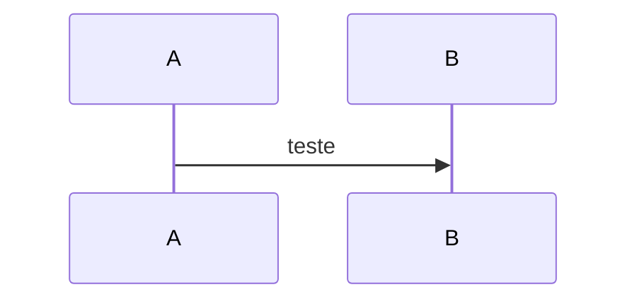

# Comandos Úteis

<!-- CLASSIFICACAO: SISTEMA-DEV -->
<!-- CLASSIFICACAO: IA -->

Referência rápida de comandos para o projeto. Atualizado conforme dúvidas da equipe.

---

## Git

```bash
# Ver status dos arquivos
git status

# Baixar atualizações do repositório
git pull

# Adicionar arquivos e commitar
git add .
git commit -m "descrição do que foi feito"

# Enviar para o repositório
git push

# Criar nova branch de feature
git checkout -b feature/nome-da-feature

# Voltar para develop
git checkout develop

# Ver branches locais
git branch

# Ver histórico de commits (últimos 10)
git log -n 10 --oneline

# Comparar 2 commits (ou branches, ou tags)
git diff <sha1> <sha2>
git diff <sha1> <sha2> -- caminho/do/arquivo   # só um arquivo
git diff --name-only <sha1> <sha2>             # só nomes de arquivos que mudaram
git diff --stat <sha1> <sha2>                  # resumo com +/- por arquivo
git diff main develop                          # comparar branches
git diff HEAD~1 HEAD                           # HEAD vs commit anterior

# Listar commits que estão em B mas não em A
git log <sha1>..<sha2> --oneline

# Ver o diff de um único commit
git show <sha>

# Comparar no GitHub via URL:
# https://github.com/<user>/<repo>/compare/<sha1>...<sha2>

# Ver conteúdo completo de um arquivo em um commit específico
git show <sha>:caminho/do/arquivo

# Histórico de commits que tocaram um arquivo
git log --oneline -- caminho/do/arquivo

# Histórico com o diff de cada commit no arquivo (-p = patch)
git log -p -- caminho/do/arquivo
```

**Dica VSCode/Windsurf/Cursor:** botão direito no arquivo → `Open Timeline`. Lista todos os commits que tocaram aquele arquivo; `Ctrl+Click` em duas entradas compara as versões lado a lado.

### Conflitos de merge — Merge Editor não abre

Sintoma: em **Source Control**, ao clicar em **Resolve in Merge Editor**, nada acontece (comum no Cursor/VS Code no Windows).

**Ordem recomendada (do mais rápido ao mais manual):**

1. **Abrir o arquivo com conflito primeiro** (ex.: `docs/comandos_uteis.md`) — o editor inline mostra botões *Accept Current Change* / *Accept Incoming Change* / *Accept Both* acima de cada bloco `<<<<<<<`.

2. **Paleta de comandos:** `Ctrl+Shift+P` → digite **`Merge Editor: Open Merge Editor`** (com o arquivo em foco e em estado *unmerged*).

3. **Conferir setting** (`Ctrl+,` → buscar `merge editor`):
   - `git.mergeEditor` = **true**
   - Reiniciar o Cursor após alterar.

4. **Terminal (sempre funciona):**
   ```powershell
   git status                          # arquivos em "Unmerged paths"
   git diff --name-only --diff-filter=U
   # Editar o arquivo: remover <<<<<<< ======= >>>>>>> e deixar o texto final
   git add caminho/do/arquivo
   git commit                          # conclui o merge (sem -m usa msg padrão)
   ```

5. **Comparar versões manualmente:**
   ```powershell
   git show :2:docs/comandos_uteis.md   # sua branch (HEAD / "Current")
   git show :3:docs/comandos_uteis.md   # branch entrando ("Incoming")
   ```

6. **Desistir do merge:** `git merge --abort`

**No merge atual deste repo:** só `docs/comandos_uteis.md` está em conflito — dá para resolver editando o arquivo (manter as duas seções se fizer sentido) e `git add docs/comandos_uteis.md`.

### GitHub — permissões para colaboradora (Projects / Issues)

Repo em **conta pessoal** (`BetoFigu66/...`): o GitHub **não oferece** papéis Read / Write / Admin na tela de colaboradores — só **dono** ou **colaborador** (acesso leitura+escrita no repo). Por isso **não aparece dropdown de papel** ao lado do nome.

**O que a Kika já tem como colaboradora:** push, issues, labels, milestones no repositório.

**O que ela não consegue só com isso:** criar ou administrar um **Project v2 na sua conta** (`BetoFigu66`). Project tem permissão **separada** do repo.

**Solução A — Beto cria o Project e delega (recomendado):**

1. Beto: avatar (canto sup. direito) → **Your projects** → **New project** → vincular repo `AgenteAssistenteDeVendas`
2. No Project: **⋯** → **Settings** → **Manage access**
3. **Invite collaborators** → usuário da Kika → papel **Admin**
4. Kika aceita em https://github.com/notifications

**Solução B — Kika cria o Project na conta dela:**

1. Kika: **Your projects** → **New project**
2. **Add repository** → escolher `BetoFigu66/AgenteAssistenteDeVendas` (só aparece se ela já for colaboradora aceita)
3. Beto não precisa ser Admin do Project dela; ambos usam o mesmo board

**Conferir colaboradora no repo (sem papel para mudar):**

1. https://github.com/BetoFigu66/AgenteAssistenteDeVendas/settings/access
2. Aba **Direct access** → nome da Kika deve aparecer como **Collaborator**
3. Se estiver **Pending**: ela precisa aceitar o convite antes

**Para ter dropdown de papel (Read/Triage/Admin etc.):** criar **Organization** gratuita, transferir o repo para lá e convidar membros com papéis — opção de médio prazo.

Ver também: `artefatos/gerente_de_projetos/proposta_github_projects.md` §6.1.

---

## Docker

```bash
# Subir todos os containers
docker-compose up

# Subir em background (sem travar o terminal)
docker-compose up -d

# Parar containers
docker-compose down

# Ver containers rodando
docker ps

# Ver logs de um container
docker logs <nome-do-container>

# Rebuild após mudanças no Dockerfile
docker-compose up --build

# Limpar containers parados e imagens não usadas
docker system prune
```

### Docker no Windows: PowerShell vs WSL

**Recomendação:** usar **um só** ambiente para `docker-compose` (PowerShell **ou** WSL), alinhado ao `cloudflared` no Windows (`localhost:3000`).

| Onde roda | Quando usar |
|-----------|-------------|
| **PowerShell** (Docker Desktop) | Padrão do projeto para deploy via túnel; após `.dockerignore` na raiz |
| **WSL** | Dev Python local (`venv`); `docker-compose` no WSL também funciona, mas evite alternar |

**Erro:** `open backend\venv\lib64: The file cannot be accessed by the system` ao fazer `docker-compose up --build` no PowerShell.

**Causa:** o build envia `backend/venv` (criado no WSL/Linux) com symlinks que o Docker Desktop no Windows não lê.

**Correção:** arquivos `.dockerignore` na raiz e em `frontend/` (já no repo) excluem `venv` e `node_modules`. Depois:

```powershell
docker-compose build --no-cache
docker-compose up -d
```

Se ainda falhar, apague o venv local (só afeta dev fora do Docker): `Remove-Item -Recurse -Force backend\venv`

**Erro (WSL):** `bad interpreter: No such file or directory` ao rodar `./run.sh` ou `uvicorn`.

**Causa:** o `backend/venv` foi criado com um Python que não existe mais — comum após limpeza de disco que removeu Miniconda (`~/miniconda3`) ou outro interpretador usado na criação do venv. O symlink `venv/bin/python` fica quebrado.

**Diagnóstico (WSL):**

```bash
cd backend
ls -la venv/bin/python    # symlink quebrado → alvo inexistente
head -1 venv/bin/uvicorn  # shebang aponta para o python morto
```

**Correção:** recriar o venv no mesmo ambiente em que você desenvolve (WSL ou Windows — não misturar):

```bash
cd backend
rm -rf venv
python3 -m venv venv          # WSL/Linux
source venv/bin/activate
pip install -r requirements.txt
./run.sh
```

No PowerShell (se dev for só no Windows): `python -m venv venv` → `venv\Scripts\Activate.ps1` → `pip install -r requirements.txt`.

**Requisito:** Python **3.10+** (o código usa `list[str]` etc.). No WSL Ubuntu 20.04 o `python3` do sistema é **3.8** — insuficiente.

**Opção recomendada (WSL, sem sudo, sem Miniconda):** instalar Python 3.11 via [uv](https://github.com/astral-sh/uv) (~30 MB, em `~/.local/share/uv/`):

```bash
# Uma vez no WSL
curl -LsSf https://astral.sh/uv/install.sh | sh
~/.local/bin/uv python install 3.11

# Recriar venv do projeto
cd backend
bash _recreate_venv_wsl.sh
source venv/bin/activate
cd ..
pip install -r requirements.txt    # pre-commit, pytest, agentes
pre-commit install
```

O script `backend/_recreate_venv_wsl.sh` usa `~/.local/bin/python3.11` (uv). Para outro interpretador: `PYTHON_WSL=/caminho/python3.11 bash _recreate_venv_wsl.sh`.

**Alternativa com sudo (apt/deadsnakes):** se preferir Python do sistema em vez de uv:

```bash
sudo add-apt-repository -y ppa:deadsnakes/ppa
sudo apt update
sudo apt install -y python3.11 python3.11-venv
cd backend && rm -rf venv && python3.11 -m venv venv
```

**Não use** o `python3` do WSL 20.04 (3.8) nem o `python.exe` do Windows para criar o venv no WSL — o primeiro é antigo; o segundo gera `venv/Scripts/` (incompatível com `source venv/bin/activate` e `./run.sh`).

**Erro (WSL):** `connection to server at "localhost" (127.0.0.1), port 5433 failed: server closed the connection unexpectedly`.

**Causa:** container Postgres (`inforrel_postgres`) parou de forma abrupta (limpeza de disco, reboot, Docker reiniciado). O TCP na 5433 responde, mas o Postgres recusa o handshake.

**Correção:**

```powershell
# PowerShell (Docker Desktop)
docker restart inforrel_postgres
docker exec inforrel_postgres pg_isready -U inforrel -d assistente_vendas
```

Se persistir: `docker-compose logs postgres` e, em último caso, `docker-compose up -d postgres` (volume `postgres_data` preserva os dados).

---

## Dois ambientes na mesma máquina (Dev + QA)

| Ambiente | Backend | Frontend | Como subir | Público |
|----------|---------|----------|------------|---------|
| **Dev** (seu trabalho) | `8001` | `3001` | `backend/run.sh` + `frontend/run.sh` (nativo, hot reload) | só `localhost` |
| **QA** (Kika / túnel) | `8000` | `3000` | `docker-compose up -d` | `https://app.auxvendas.com` via Cloudflare |

**Regra:** o túnel Cloudflare (`cloudflared`) aponta **sempre** para `http://localhost:3000` (stack Docker/QA). **Nunca** para `3001`.

### Subir Dev (codando)

```powershell
# Terminal 1 — Postgres (compartilhado; só precisa estar up uma vez)
docker-compose up -d postgres

# Terminal 2 — backend dev
cd backend
# Copiar .env.example → .env com API_PORT=8001 (se ainda não tiver)
.\run.sh

# Terminal 3 — frontend dev
cd frontend
.\run.sh
# ou: npm run dev
```

Acessos locais: http://localhost:3001 (painel) · http://localhost:8001/docs (API)

### Subir QA (validação / Twilio / túnel)

```powershell
cd C:\Beto\Pessoal\Python\git\AgenteAssistenteDeVendas
docker-compose up -d --build
cloudflared tunnel run auxvendas-dev
```

Acessos: http://localhost:3000 (local) · https://app.auxvendas.com (público)

### Checklist de configuração

1. **`backend/.env`:** `API_PORT=8001` (dev). Docker ignora isso e usa porta `8000` interna.
2. **`frontend/.env` ou `.env.development`:** dev nativo (`run.sh`): `VITE_DEV_PORT=3001`, `VITE_DEV_API_PROXY=http://127.0.0.1:8001`. Backend via Docker + Vite local: **não** use `8001` — omita o `.env` (padrão do `vite.config.js` é `8000`) ou `VITE_DEV_API_PROXY=http://127.0.0.1:8000`.
3. **`%USERPROFILE%\.cloudflared\config.yml`:** ingress `app.auxvendas.com` → `http://localhost:3000` (sem alteração).
4. **Twilio webhook:** `https://app.auxvendas.com/webhook` (QA). Dev em `8001` não recebe webhook da Twilio salvo túnel separado.
5. **Postgres:** ambos usam `localhost:5433` / DB `assistente_vendas` por padrão — **dados compartilhados**. Para isolar dev de QA, crie outro database no mesmo Postgres e ajuste `DATABASE_URL` no `.env` de dev.

### Conflito de portas

```powershell
netstat -ano | findstr ":8000 :8001 :3000 :3001"
```

Se `8000` ou `3000` estiverem ocupados fora do Docker, o QA não sobe. Se `8001`/`3001` ocupados, o dev não sobe. Os dois ambientes **podem** rodar ao mesmo tempo.

### Erro no Vite: `proxy error` / `ECONNREFUSED 127.0.0.1:8001`

Sintoma: aba Acompanhamento mostra *"Erro ao carregar atendimentos ativos"*; terminal do Vite registra `connect ECONNREFUSED 127.0.0.1:8001`; **backend Docker não mostra erro** (a requisição nem chega na API).

Causa: Vite (`npm run dev`, porta 3001) aponta proxy para porta errada. Backend Docker escuta em **8000**; dev nativo (`backend/run.sh`) em **8001**.

Correção:

```powershell
# Backend Docker + Vite local — apague ou ajuste frontend/.env:
# VITE_DEV_API_PROXY=http://127.0.0.1:8000
# (sem .env, o vite.config.js já usa 8000 por padrão)

# Dev nativo (run.sh nos dois) — frontend/.env:
# VITE_DEV_API_PROXY=http://127.0.0.1:8001
```

Reinicie o Vite após alterar. Teste: http://localhost:3001/health ou http://localhost:8000/health conforme o ambiente.

Alternativa sem Vite: use o frontend Docker em http://localhost:3000 (Nginx já faz proxy para `backend:8000`).

---

## Backend (Python)

```bash
# Criar ambiente virtual (apenas primeira vez)
cd backend
python -m venv venv

# Ativar ambiente virtual (Windows PowerShell)
venv\Scripts\Activate.ps1

# Ativar ambiente virtual (Windows CMD)
venv\Scripts\activate.bat

# Ativar ambiente virtual (WSL/Linux/Mac)
source venv/bin/activate

# Instalar dependências
pip install -r requirements.txt

# Rodar o backend (opção 1 - simples)
python main.py

# Rodar o backend (opção 2 - mais controle, reload automático)
# Dev local: porta 8001 (QA/docker usa 8000)
uvicorn main:app --host 0.0.0.0 --port 8001 --reload
# ou: .\run.sh

# Nível de log (padrão WARNING). SQL só aparece com SQL_ECHO=true no .env
# LOG_LEVEL=WARNING
# SQL_ECHO=false

# Timestamps: gravados em UTC (timestamptz). Exibição no painel em America/Sao_Paulo.
# Consulta SQL direta — ver horário BRT:
#   SELECT timestamp AT TIME ZONE 'America/Sao_Paulo' FROM mensagens ORDER BY id DESC LIMIT 5;

# Rodar migrations do banco
alembic upgrade head

# Criar nova migration
alembic revision --autogenerate -m "descricao"

# Rodar todos os testes
python -m pytest

# Rodar testes de um arquivo específico
python -m pytest tests/test_campos_pendentes.py

# Rodar testes com saída detalhada (-v) e parar no primeiro erro (-x)
python -m pytest tests/test_extracao_entidades_fase_d.py -v -x

# Rodar apenas um teste específico
python -m pytest tests/test_processador_finalizando_coleta_ativa.py::test_f4_resumo_quando_tudo_capturado -v
```

---

## PostgreSQL

```bash
# Subir apenas o postgres (sem backend/frontend)
docker-compose up -d postgres

# Ver logs do postgres
docker-compose logs -f postgres

# Acessar shell do postgres (dentro do container)
docker exec -it inforrel_postgres psql -U inforrel -d assistente_vendas

# Parar e remover volume (APAGA TODOS OS DADOS)
docker-compose down -v
```

### LLM Provider (Groq)

1. Crie uma conta em https://console.groq.com
2. Gere uma API Key em https://console.groq.com/keys
3. Adicione no seu `backend/.env`:
```env
LLM_PROVIDER=groq
LLM_MODEL=llama-3.1-8b-instant
LLM_API_KEY=sua_chave_aqui
```

**Importante:** Nunca commitar `.env`. Está no `.gitignore`.

Para trocar de provider (ex: OpenAI, Gemini, Ollama), basta alterar `LLM_PROVIDER` e implementar a classe em `backend/services/llm/`.

---

### Embeddings / RAG (EMBEDDING_API_KEY)

O provider padrão é **OpenAI** (`text-embedding-3-small`, 1536 dimensões).
A mesma conta OpenAI usada eventualmente para o LLM serve aqui; a chave é a mesma.

**Como obter:**

1. Acesse https://platform.openai.com e faça login (ou crie conta).
2. No menu lateral, clique em **API keys**.
3. Clique em **+ Create new secret key**, dê um nome (ex: `inforrel-dev`) e copie a chave gerada — ela só aparece uma vez.
4. Adicione no seu `backend/.env`:

```env
EMBEDDING_PROVIDER=openai
EMBEDDING_MODEL=text-embedding-3-small
EMBEDDING_API_KEY=sk-...sua_chave_aqui...
```

**Custo estimado (referência):** `text-embedding-3-small` custa US$ 0,02 por 1 milhão de tokens.
Uma ingestão inicial do catálogo completo da Inforrel fica na casa de centavos.
Buscas em produção também são baratas (cada pergunta = 1 chamada pequena).

**Fallback sem chave (desenvolvimento sem embeddings):**
Defina `RAG_ENABLED=false` no `.env` para desabilitar a RAG completamente.
O agente continua funcionando com templates e LLM, só não usa o catálogo vetorial.

```env
RAG_ENABLED=false
```

Erro de quota na API do OpenAI (insufficient_quota).
Entrei em https://platform.openai.com/settings/billing, pediu para criar uma organização e adicionar um metodo de pagamento.
(Signed in with betofigu@gmail.com)
Organization name: "BF Desenvolvimento de sistemas"
What best describes you?: "Data Scientist"

API key name: inforrel-dev
Project name: Inforrel
API keys belong to projects to help you manage usage limits, team access, and data security.
---

### RAG - inventario das fontes

```powershell
# Gera o inventario das fontes raw usadas pela RAG
python backend\scripts\inventariar_fontes_rag.py

# Gerar em outro caminho, se necessario
python backend\scripts\inventariar_fontes_rag.py --saida backend\data\rag\inventario_fontes.json
```

Saida padrao: `backend/data/rag/inventario_fontes.json`.

### RAG - pre-processamento das fontes

```powershell
# Gera documentos normalizados em JSONL a partir do inventario
python backend\scripts\preprocessar_conhecimento_rag.py

# Informar caminhos explicitamente, se necessario
python backend\scripts\preprocessar_conhecimento_rag.py --inventario backend\data\rag\inventario_fontes.json --saida backend\data\rag\documentos_normalizados.jsonl --resumo backend\data\rag\preprocessamento_resumo.json
```

Saidas padrao:

- `backend/data/rag/documentos_normalizados.jsonl`
- `backend/data/rag/preprocessamento_resumo.json`

### RAG - consolidacao e deduplicacao

```powershell
# Deduplica documentos normalizados e gera a base consolidada
python backend\scripts\consolidar_conhecimento_rag.py

# Ajustar o limiar para marcar documentos similares, se necessario
python backend\scripts\consolidar_conhecimento_rag.py --similaridade-minima 0.82
```

Saidas padrao:

- `backend/data/rag/documentos_consolidados.jsonl`
- `backend/data/rag/consolidacao_resumo.json`

### RAG - chunking

```powershell
# Gera chunks a partir dos documentos consolidados
python backend\scripts\gerar_chunks_rag.py

# Ajustar tamanhos, se necessario
python backend\scripts\gerar_chunks_rag.py --alvo-tokens 700 --max-tokens 900 --overlap-tokens 100
```

Saidas padrao:

- `backend/data/rag/chunks_conhecimento.jsonl`
- `backend/data/rag/chunking_resumo.json`

### RAG - banco pgvector

```powershell
# Recria apenas o container Postgres usando a imagem pgvector definida no docker-compose
# Preserva o volume postgres_data existente.
docker-compose up -d postgres

# Aplica migrations pelo container backend
docker exec agenteassistentedevendas-backend-1 alembic upgrade head

# Verifica revision atual
docker exec agenteassistentedevendas-backend-1 alembic current

# Confirma extensao vector
docker exec inforrel_postgres psql -U inforrel -d assistente_vendas -c "SELECT extname FROM pg_extension WHERE extname = 'vector';"

# Inspeciona tabela da RAG
docker exec inforrel_postgres psql -U inforrel -d assistente_vendas -c "\d+ documentos_conhecimento"
```

---

### Curador de conhecimento — pacote de análise de report

Gera YAML com contexto do report, re-busca Q&A/RAG e sugestão de documentos em `docs/FoldersProdutos/`. Ver `artefatos/curador_conhecimento/guia_operacional.md`.

```powershell
# YAML (salvar para o agente [curador_conhecimento])
curl -s "http://localhost:8000/api/reports/42/pacote-analise" -o artefatos\curador_conhecimento\pacotes\report_042.yaml

# JSON (debug)
curl -s "http://localhost:8000/api/reports/42/pacote-analise?formato=json"

# Janela maior de mensagens
curl -s "http://localhost:8000/api/reports/42/pacote-analise?antes=8&depois=5"
```

No Cursor, após salvar o YAML:

```
[curador_conhecimento] analise artefatos/curador_conhecimento/pacotes/report_042.yaml e gere proposta
```

---
### Limpeza de dados de telefone da base

Limpa dados relacionados a um telefone (reports, mensagens, processamentos, itens_orcamento, orcamentos, itens_negociacao, atendimento_infos, atendimentos, contatos).

```powershell
curl.exe -X DELETE "http://localhost:8000/api/dev/telefones/198765412365"
```

No Cursor, após salvar o YAML:

```
[curador_conhecimento] analise artefatos/curador_conhecimento/pacotes/report_042.yaml e gere proposta
```
---
### Dev — apagar dados de teste por telefone

Remove contato, atendimentos, mensagens, processamentos, reports e orçamentos vinculados ao número. **Não** remove empresa nem pessoa. Requer `DEBUG=True` no backend.

```powershell
# PowerShell: usar curl.exe (curl sozinho é alias do Invoke-WebRequest)
curl.exe -X DELETE "http://localhost:8000/api/dev/telefones/+5511999999999"

# Via túnel cloudflared (exemplo)
curl.exe -X DELETE "https://auxvendas-dev.seudominio.com/api/dev/telefones/+5511999999999"
```

Resposta: contagem por entidade (`removidos.reports`, `removidos.mensagens`, etc.). `404` se não houver dados.

---

### QA Engineer — checks automatizados e pre-commit

Os checks de qualidade ficam em `agentes/qa_engineer.py` (registry via `@registrar_check`). Ver diretriz D06 em `artefatos/implementador/diretrizes.md`.

O hook usa `bash scripts/run_qa_check_precommit.sh`, que localiza o Python em `backend/venv` tanto no **Windows** (`Scripts/python.exe`) quanto no **WSL/Linux** (`bin/python`) — sem caminho Unix fixo no `.pre-commit-config.yaml`.

**Pré-requisito no Windows:** [Git for Windows](https://git-scm.com/download/win) (inclui `bash` no PATH — o hook chama `bash scripts/run_qa_check_precommit.sh`).

**Setup (uma vez por clone):**

Use o venv local do projeto (`backend/venv`). O `pre-commit` fica em `requirements.txt` da **raiz** (QA/agentes), não em `backend/requirements.txt`.

**Regra:** rode `pre-commit install` no **mesmo ambiente** em que você faz `git commit` (PowerShell **ou** WSL — não misturar).

```bash
# WSL (se commitar pelo WSL)
cd backend
source venv/bin/activate
cd ..
pip install -r requirements.txt   # pre-commit, pytest, agentes
pre-commit install
```

```powershell
# PowerShell (se commitar pelo Windows / Git for Windows)
cd backend
python -m venv venv                # se ainda não existir
.\venv\Scripts\Activate.ps1
pip install -r ..\requirements.txt
cd ..
pre-commit install
```

**Erro:** hook falha no PowerShell com caminho `backend/venv/bin/python` ou `/mnt/c/...`.

**Causa:** versão antiga do `.pre-commit-config.yaml` com Python Unix hardcoded, **ou** `pre-commit install` rodado no WSL enquanto o commit é feito no Git for Windows (o hook grava `INSTALL_PYTHON` com path WSL inacessível ao bash do Windows).

**Correção (Kika — fluxo PowerShell):**

```powershell
cd C:\caminho\para\AgenteAssistenteDeVendas\backend
python -m venv venv
.\venv\Scripts\Activate.ps1
pip install -r ..\requirements.txt
cd ..
pre-commit install
pre-commit run --all-files          # testar antes do commit
```

Confirme o interpretador gravado no hook:

```powershell
Get-Content .git\hooks\pre-commit -TotalCount 10
```

`INSTALL_PYTHON` deve apontar para `...\backend\venv\Scripts\python.exe` (Windows), **não** para `/mnt/c/...` nem `.../bin/python`.

**Rodar o check manualmente (sem pre-commit):**

```powershell
.\scripts\run_qa_check_precommit.ps1
```

```bash
# WSL
./scripts/run_qa_check_precommit.sh
```

**Erro:** `No module named pre_commit` com path de **outro projeto** (ex.: `Transcriptor/.venv/bin/python`).

**Causa:** `pre-commit install` foi rodado com outro venv ativo; o hook grava esse Python em hardcode em `.git/hooks/pre-commit`.

**Correção:** ativar `backend/venv` **deste** repo → `pip install -r requirements.txt` → `pre-commit install`. Confirme com `Get-Content .git\hooks\pre-commit -TotalCount 10` (PowerShell) ou `head -7 .git/hooks/pre-commit` (WSL) que `INSTALL_PYTHON` aponta para o venv **deste** repositório.

**Rodar manualmente (python direto, com venv ativo):**
```powershell
# Todos os checks registrados
python scripts/qa_check.py

# Somente os checks do escopo pre-commit (rápidos)
python scripts/qa_check.py --escopo pre-commit

# Um check específico
python scripts/qa_check.py --check gitkeep-redundantes

# Listar checks registrados
python scripts/qa_check.py --listar
```

**Severidade:** `error` bloqueia o commit; `warning` e `info` apenas avisam.

**Adicionar um novo check:** decorar uma função em `agentes/qa_engineer.py`:
```python
@registrar_check(id="meu-check", titulo="...", severidade="warning",
                 escopos=["sempre", "pre-commit"])
def _check_meu(raiz: Path) -> CheckResult:
    ...
```

**Rodar pre-commit sobre tudo (útil após mudanças grandes):**
```powershell
pre-commit run --all-files
```

---

### Cobertura de REQs — atualizar `cobertura_evolucao.yaml`

Histórico longitudinal da cobertura dos REQs sprint a sprint vive em
`artefatos/gerente_de_projetos/cobertura_evolucao.yaml`. **Não editar à mão**
sprints com `origem: snapshot_formal` — o arquivo é gerado a partir dos
`sprint_NN_*_interno.yaml` em `artefatos/gerente_de_projetos/reports/`.

**Regerar manualmente (recomendado ao fechar uma sprint):**
```powershell
python agentes/scripts/gerente_de_projetos/atualiza_cobertura_evolucao.py
```

**Enforcement automático:** o check `cobertura-evolucao-desatualizada`
(`@registrar_check` em `agentes/qa_engineer.py`, escopo `pre-commit`,
severidade `error`) garante que o arquivo nunca fique desincronizado.

**Comportamento (padrão auto-fix tipo black):** se o arquivo divergir do
esperado ao tentar comitar, o hook **regenera o arquivo automaticamente**
no disco e bloqueia o commit pedindo `git add` + retry. Fluxo:

```powershell
git commit -m "..."                                                   # falha
# Hook regenera cobertura_evolucao.yaml e mostra a dica.
git add artefatos/gerente_de_projetos/cobertura_evolucao.yaml
git commit -m "..."                                                   # passa
```

Resultado: **1 commit no histórico**, 2 tentativas de `git commit` na primeira vez.

Diretriz aplicável: G06 em `artefatos/gerente_de_projetos/diretrizes.md`.

---

### Conexão DBeaver / cliente externo

| Campo | Valor |
|-------|-------|
| Host | `localhost` |
| Porta | `5433` *(5432 interno do container, 5433 exposto para não conflitar com postgres local)* |
| Database | `assistente_vendas` |
| User | `inforrel` |
| Password | `inforrel_dev` |

---

## Frontend (Node.js)

```bash
# Instalar dependências (apenas primeira vez ou após pull)
cd frontend
npm install

# Rodar em desenvolvimento (hot reload) — porta 3001 (QA/docker usa 3000)
cd frontend
npm run dev
# Acesse: http://localhost:3001

# Build de produção
npm run build

# Se npm falhar com UNABLE_TO_VERIFY_LEAF_SIGNATURE (certificado/proxy no Windows),
# validar o build via Docker (usa node:20-alpine dentro do container):
docker compose build frontend

# Preview do build
npm run preview

# Se o hot reload não funcionar, limpar cache:
# 1. Parar o servidor (Ctrl+C)
# 2. Deletar cache do Vite
Remove-Item -Recurse -Force node_modules/.vite
# 3. Rodar novamente
npm run dev
# 4. No navegador: Ctrl+Shift+R (force refresh)
```

---

## WSL (Windows Subsystem for Linux)

```bash
# Abrir WSL
wsl

# Ver distribuições instaladas
wsl --list --verbose

# Reiniciar WSL (PowerShell como Admin)
wsl --shutdown

# Acessar pasta do Windows no WSL
cd /mnt/c/Beto/Pessoal/Python/git/AgenteAssistenteDeVendas
```

### gh CLI instalado no WSL (não no PowerShell)

**Diagnóstico** — se aparecer `Error: no such option: --milestone` ou
`Usage: gh issue [OPTIONS] USER_REPO_NUMBER`, o binário `gh` **não** é o
GitHub CLI oficial (ou está muito antigo):

```bash
which gh
gh --version          # esperado: gh version 2.x (https://github.com/cli/cli)
gh issue list --help  # deve listar -m, --milestone
```

Instalação correta no WSL (Ubuntu/Debian):

```bash
(type -p wget >/dev/null || (sudo apt update && sudo apt install wget -y)) \
  && sudo mkdir -p -m 755 /etc/apt/keyrings \
  && wget -qO- https://cli.github.com/packages/githubcli-archive-keyring.gpg | sudo tee /etc/apt/keyrings/githubcli-archive-keyring.gpg > /dev/null \
  && sudo chmod go+r /etc/apt/keyrings/githubcli-archive-keyring.gpg \
  && echo "deb [arch=$(dpkg --print-architecture) signed-by=/etc/apt/keyrings/githubcli-archive-keyring.gpg] https://cli.github.com/packages stable main" | sudo tee /etc/apt/sources.list.d/github-cli.list > /dev/null \
  && sudo apt update && sudo apt install gh -y
gh auth login
```

**Listar issues do Sprint 03** (repo já configurado com `git remote`):

```bash
cd /mnt/c/Beto/Pessoal/Python/git/AgenteAssistenteDeVendas

# Opção A — flag curta (GitHub CLI 2.x)
gh issue list -m "Sprint 03" -s open -L 100

# Opção B — search (funciona quando --milestone falha em versões antigas)
gh issue list --search 'milestone:"Sprint 03" state:open' -L 100

# Opção C — REST API (sempre funciona, milestone Sprint 03 = número 1)
gh api 'repos/BetoFigu66/AgenteAssistenteDeVendas/issues?milestone=1&state=open&per_page=100' \
  --jq '.[] | "\(.number)\t\(.title)"'
```

Fechar issue após implementar:

```bash
gh issue close 10 --comment "T-A3: ultima_mensagem_at implementada."
```

Do **PowerShell**, delegar ao WSL:

```powershell
wsl bash -lc "cd /mnt/c/Beto/Pessoal/Python/git/AgenteAssistenteDeVendas && gh issue list -m 'Sprint 03' -s open -L 100"
```

Se `wsl` falhar com timeout (`Wsl/Service/0x8007274c`), reinicie o serviço (`wsl --shutdown` como Admin, depois `wsl`) ou liste issues pela **API pública** (sem auth):

```powershell
# milestone Sprint 03 = número 1 no repo
Invoke-RestMethod "https://api.github.com/repos/BetoFigu66/AgenteAssistenteDeVendas/issues?milestone=1&state=open&per_page=100" |
  Select-Object number, title
```

### Reduzir tamanho do disco WSL (`ext4.vhdx` / `LocalState`)

A pasta `LocalState` do Ubuntu na Microsoft Store guarda o arquivo **`ext4.vhdx`** — o disco virtual do WSL2. Apagar arquivos **dentro** do Linux **não encolhe** o `.vhdx` no Windows automaticamente.

**Diagnóstico rápido:**

```powershell
# Tamanho do arquivo no Windows
Get-Item "$env:LOCALAPPDATA\Packages\CanonicalGroupLimited.UbuntuonWindows_*\LocalState\ext4.vhdx" |
  Select-Object FullName, @{N='GB';E={[math]::Round($_.Length/1GB,2)}}

# Uso real dentro do Ubuntu
wsl -d Ubuntu -e df -h /
wsl -d Ubuntu -e bash -lc "du -sh /home /var /usr 2>/dev/null"
```

Se o `.vhdx` for muito maior que o `Used` do `df`, o ganho principal é **limpar dentro do WSL** + **compactar o VHDX**.

**Passo 1 — limpar dentro do Ubuntu (WSL):**

```bash
# caches seguros
pip cache purge
sudo apt autoremove -y
sudo apt clean
sudo rm -rf /var/cache/apt/archives/*

# Docker (se usar dentro do Ubuntu)
docker system prune -a --volumes   # cuidado: remove imagens/containers não usados

# ver maiores pastas do usuário
du -sh ~/* ~/.[!.]* 2>/dev/null | sort -hr | head -20
```

Candidatos comuns: `~/.cache/pip`, `~/.cache/whisper`, `~/.vscode-server`, `miniconda3`, `.cargo`, `.rustup`, `.npm`, `.gradle`.

**Passo 2 — encerrar todo o WSL (PowerShell):**

```powershell
# feche Docker Desktop antes, se estiver aberto
wsl --shutdown
```

**Passo 3 — compactar o VHDX (PowerShell como Administrador):**

Opção A — `diskpart` (funciona na maioria das instalações):

```powershell
$vhd = (Get-Item "$env:LOCALAPPDATA\Packages\CanonicalGroupLimited.UbuntuonWindows_*\LocalState\ext4.vhdx").FullName
@"
select vdisk file="$vhd"
attach vdisk readonly
compact vdisk
detach vdisk
exit
"@ | diskpart
```

**Quanto tempo demora?** Em VHDX grande (ex.: 100+ GB), conte **15–60+ minutos** conforme SSD/HDD e quanto há para recuperar. A janela do DiskPart costuma ficar **quase em branco** durante o `compact vdisk` — isso é normal; não significa que travou.

**Como saber se está processando:**

1. **Gerenciador de Tarefas** → aba **Desempenho** → disco **C:** com atividade de leitura/gravação; ou aba **Detalhes** → `diskpart.exe` / `VmmemWSL` consumindo I/O.
2. **Tamanho do arquivo** (outro PowerShell): `Get-Item $vhd | Select-Object Length, LastWriteTime` — o `LastWriteTime` muda e o tamanho pode ir caindo (nem sempre de forma contínua).
3. **Não feche** a janela do DiskPart nem desligue o PC até voltar ao prompt `DISKPART>` ou fechar sozinha com `exit` concluído.

Se após **1–2 h** o disco estiver em **0%** de atividade e o tamanho do `.vhdx` não mudou, aí sim pode ter travado — feche o DiskPart, confira se `wsl --shutdown` ainda vale e tente de novo.

Opção B — Hyper-V (se o módulo existir):

```powershell
Optimize-VHD -Path "C:\Users\betof\AppData\Local\Packages\CanonicalGroupLimited.UbuntuonWindows_79rhkp1fndgsc\LocalState\ext4.vhdx" -Mode Full
```

**Passo 4 — evitar que cresça de novo sem recuperar espaço:**

```powershell
wsl --manage Ubuntu --set-sparse true
```

**Não fazer:** apagar manualmente a pasta `LocalState` ou o `ext4.vhdx` — isso destrói o Ubuntu.

**Docker Desktop** usa outra distro WSL (`docker-desktop`) com VHDX próprio; se também estiver grande, repetir limpeza (`docker system prune`) + compactação na pasta `%LOCALAPPDATA%\Docker\wsl\`.

---

## PowerShell

```powershell
# Ver processos usando uma porta
netstat -ano | findstr :8000

# Matar processo por PID
taskkill /PID <numero> /F

# Limpar tela
cls

# Ver variáveis de ambiente
$env:PATH
```


### Abrir PowerShell como Administrador (Windows)

O terminal integrado do **Cursor/VSCode não roda elevado** — `cloudflared service install` e similares precisam de um terminal **fora** do IDE.

**Formas que costumam funcionar (Windows 10/11):**

| Método | Como |
|--------|------|
| Atalho de teclado | `Win` → digite `PowerShell` → `Ctrl+Shift+Enter` (abre elevado) |
| Menu Iniciar | `Win` → **Windows PowerShell** → botão direito → **Executar como administrador** |
| Menu Win+X | `Win+X` → **Terminal (Administrador)** ou **Windows PowerShell (Administrador)** |
| Prompt de UAC | No PowerShell **normal** (fora do Cursor), disparar elevação: |

```powershell
Start-Process powershell -Verb RunAs -ArgumentList '-NoExit', '-Command', 'cloudflared service install'
```

Deve aparecer o diálogo **Controle de Conta de Usuário (UAC)** → **Sim**.

**Se não abrir / não aparece “Executar como administrador”:**

1. Confirmar que a conta está no grupo **Administradores** (`Win+R` → `lusrmgr.msc` → Groups → Administrators).
2. UAC ligado: `Win+R` → `UserAccountControlSettings` → não usar o nível mais baixo se o menu some.
3. Reiniciar **Windows Explorer**: `Ctrl+Shift+Esc` → Processos → **Windows Explorer** → Reiniciar.
4. Tentar **Prompt de Comando** elevado (`cmd` → `Ctrl+Shift+Enter`) e rodar o mesmo comando.
5. Política corporativa / conta sem privilégio: só um admin da máquina pode instalar o serviço.

**Plano B (sem serviço):** após o reboot, subir manualmente `cloudflared tunnel run auxvendas-dev` (ver `artefatos/arquiteto_de_sistemas/disponibilizacao_auxvendas_com.md`).

### Erro "execução de scripts foi desabilitada neste sistema"

Sintoma: ao rodar `.\algum_script.ps1` aparece `UnauthorizedAccess` /
`PSSecurityException` mencionando `about_Execution_Policies`.

Três caminhos, do mais pontual ao mais persistente:

```powershell
# 1) Bypass apenas para esta execução (não muda nada do sistema)
powershell -ExecutionPolicy Bypass -File .\scripts\bootstrap_github_projects.ps1

# 2) Liberar para o usuário atual de uma vez (não exige admin)
Set-ExecutionPolicy -Scope CurrentUser -ExecutionPolicy RemoteSigned

# Conferir as políticas vigentes em cada escopo
Get-ExecutionPolicy -List

# 3) Se o arquivo veio com flag de "downloaded" (Zone.Identifier),
#    desbloquear pontualmente:
Unblock-File .\scripts\bootstrap_github_projects.ps1
```

`RemoteSigned` permite scripts locais e exige assinatura apenas em scripts
baixados da internet — costuma ser o equilíbrio aceitável para dev no Windows.

### gh CLI + jq: `--jq` quebra no Windows PowerShell 5.1

Sintoma: ao rodar algo como
`gh label list --json name --jq ".[] | select(.name==`"foo`") | .name"`
o `gh.exe` recebe a expressão **sem as aspas internas** (e às vezes o
pipe `|` é interpretado pelo shell), e a `jq` falha com
`failed to parse jq expression`. Acontece no Windows PowerShell 5.1, que
não escapa corretamente caracteres especiais (`|`, `"`) ao chamar
executáveis nativos. **Trocar para aspa simples externa não resolve** —
o problema é no native command argument parser, não na string.

Solução robusta: **não usar `--jq`**. Trazer o JSON cru e filtrar em
PowerShell com `ConvertFrom-Json`:

```powershell
# em vez de:
#   gh label list --json name --jq ".[] | select(.name==`"foo`")"
# fazer:

$existing = gh label list --limit 200 --json name |
            ConvertFrom-Json |
            ForEach-Object { $_.name }

if ($existing -contains 'foo') { ... }
```

Mesma ideia para `gh api`:

```powershell
$milestones = gh api '/repos/{owner}/{repo}/milestones?state=open' |
              ConvertFrom-Json
$ms = $milestones | Where-Object { $_.title -eq 'Sprint 03' }
```

Aplica-se a qualquer comando externo no Windows quando o argumento tem
aspas e/ou pipe — não é específico de `gh`. Em PowerShell 7+ (`pwsh`) o
problema some com `$PSNativeCommandArgumentPassing = 'Standard'`.

### Criar comandos e aliases:

Edite ou crie o arquivo de profile:
notepad $PROFILE

Crie funções com os comandos que deseja:

---

## VSCode / WindSurf

```json
// Ativar quebra visual de linhas longas no editor
{
  "editor.wordWrap": "on"
}
```

Atalho rapido para alternar a quebra visual de linha: `Alt + Z`.

Tambem pode ser ativado pelo menu: `View` -> `Word Wrap`.

Observacao: isso altera apenas a visualizacao no editor, sem modificar o arquivo.

### Debugar backend FastAPI no VSCode

A configuracao de execucao esta em `.vscode/launch.json` (nome: **Backend FastAPI**).  
Para iniciar:

- `F5` ou painel `Run and Debug` (`Ctrl+Shift+D`) → selecionar **Backend FastAPI**

Ela usa o ambiente virtual `backend/venv` com reload automatico em `main:app`.

### Renderizar diagramas Mermaid no preview de Markdown

O preview nativo do VSCode/Windsurf nao renderiza Mermaid; mostra como texto. Para renderizar:

1. Abrir Extensions (`Ctrl + Shift + X`)
2. Instalar **Markdown Preview Mermaid Support** (autor: `bierner`)
3. Reabrir o preview (`Ctrl + Shift + V`)

Alternativas:

- **GitHub** renderiza Mermaid nativamente ao visualizar `.md` no repositorio
- Para editar/exportar PNG/SVG: site [mermaid.live](https://mermaid.live) ou extensao **Mermaid Editor** (`tomoyukim`)
- Para realce de sintaxe: **Mermaid Markdown Syntax Highlighting** (`bpruitt-goddard`, opcional)

Sintaxe minima para testar (cole dentro de um arquivo `.md`):

~~~markdown

~~~

---

## Cloudflare Tunnel (deploy zero-custo para Kika/Rita)

Documento completo: `artefatos/arquiteto_de_sistemas/deploy_tunel_local.md`

```powershell
# Instalar (uma vez)
winget install --id Cloudflare.cloudflared

# Atualizar (PowerShell como Administrador; parar o serviço antes)
Stop-Service Cloudflared
winget upgrade --id Cloudflare.cloudflared --accept-package-agree ments
Start-Service Cloudflared
cloudflared --version
# Se Stop-Service travar: taskkill /F /IM cloudflared.exe && Start-Service Cloudflared

# Subir a app
docker-compose up -d

# Quick Tunnel (URL temporária, sem login) - frontend
# Obs: Rodar no cmd ou powershell
cloudflared tunnel --url http://localhost:3000

# Quick Tunnel para o backend (outro terminal)
cloudflared tunnel --url http://localhost:8000

# Named Tunnel (URL fixa, requer conta Cloudflare + domínio)
cloudflared tunnel login
cloudflared tunnel create inforrel-poc
cloudflared tunnel route dns inforrel-poc app.seudominio.com
cloudflared tunnel run inforrel-poc

# Instalar túnel como serviço Windows (PowerShell **fora do Cursor**, como Admin)
cloudflared service install

# Após service install: copiar config para perfil LocalSystem (senão erro 1033 no browser)
# O serviço NÃO usa C:\Users\<voce>\.cloudflared — usa systemprofile\.cloudflared
# Ver passo 7b em artefatos/arquiteto_de_sistemas/disponibilizacao_auxvendas_com.md

# Validar conexão ativa (CONNECTOR deve aparecer; senão = serviço sem config)
cloudflared tunnel info auxvendas-dev
```

---

## Atividades Periódicas

Config: `artefatos/gerente_de_projetos/atividades_periodicas.yaml`
Log:    `artefatos/gerente_de_projetos/log_atividades.yaml`

```bash
# Verificar quais atividades estão em atraso
python scripts/verificar_atividades.py

# Verificar + falhar se houver atraso (para pre-commit)
python scripts/verificar_atividades.py --strict

# Registrar que uma atividade foi concluída
python scripts/verificar_atividades.py --registrar qa_check_semanal --responsavel "Beto"
python scripts/verificar_atividades.py --registrar auditoria_ia_sprint --responsavel "Beto" --notas "3 melhorias identificadas"
```

IDs disponíveis (ver config para a lista completa):
| ID | Frequência | Tipo |
|----|-----------|------|
| `qa_check_semanal` | semanal | script |
| `auditoria_ia_sprint` | sprint | prompt_agente |
| `revisao_readme_mensal` | mensal | revisao_manual |
| `atualizacao_tendencias_mensal` | mensal | prompt_agente |

**Integração pre-commit** (adicionar em `.pre-commit-config.yaml`):
```yaml
- repo: local
  hooks:
    - id: verificar-atividades-periodicas
      name: Atividades periódicas em atraso
      entry: python scripts/verificar_atividades.py
      language: python
      pass_filenames: false
      always_run: true
```
> Usa `--strict` na `entry` se quiser bloquear o commit em caso de atraso.

---

## QA Checks (`scripts/qa_check.py`)

Executa os checks de qualidade registrados pelo agente `[qa]`.
Não requer venv especial — usa apenas bibliotecas built-in do Python.

```bash
# Listar checks disponíveis
python scripts/qa_check.py --listar

# Rodar todos os checks
python scripts/qa_check.py

# Só checks do escopo pre-commit (rápidos)
python scripts/qa_check.py --escopo pre-commit

# Rodar um check específico
python scripts/qa_check.py --check gitkeep-redundantes
```

Saída:
- `0` — tudo passou (ou só warnings/infos, não bloqueia commit)
- `1` — ao menos um check `error` falhou (bloqueia commit)

> Rode sempre da **raiz do projeto** — o script ajusta `sys.path` automaticamente.

---

## Ruff (Lint e Imports)

Ferramenta rápida (Rust) para lint, formatação e verificação de imports. Configurado em `pyproject.toml`.

```bash
# Instalar
pip install ruff

# Verificar problemas
ruff check .

# Corrigir automaticamente
ruff check --fix .

# Verificar apenas imports (isort)
ruff check --select I .

# Formatar código
ruff format .
```

O check `ruff-lint` do QA Engineer invoca `ruff check` automaticamente no pre-commit.

---

## Windsurf — Troubleshooting

### Tela em branco ao abrir

1. Fechar completamente (inclusive da bandeja do sistema)
2. Limpar cache de GPU e dados cached:
   ```powershell
   Remove-Item -Recurse -Force "$env:APPDATA\Windsurf\Cache"
   Remove-Item -Recurse -Force "$env:APPDATA\Windsurf\CachedData"
   Remove-Item -Recurse -Force "$env:APPDATA\Windsurf\Global Storage"
   ```
3. Reabrir. Se persistir, iniciar com GPU desabilitada:
   ```powershell
   $env:ELECTRON_DISABLE_GPU=1
   & "$env:LOCALAPPDATA\Programs\Windsurf\Windsurf.exe"
   ```
4. Se ainda não funcionar, reinstalar após remover totalmente:
   ```powershell
   Remove-Item -Recurse -Force "$env:APPDATA\Windsurf"
   ```

## Cursor — MCP GitHub

Permite que o agente no chat acesse issues, PRs, repositórios etc. via [servidor oficial do GitHub](https://github.com/github/github-mcp-server). **Não confundir** com o `gh` no terminal — são canais separados.

### Pré-requisitos

1. Cursor atualizado (v0.48+ para servidor remoto HTTP)
2. [Personal Access Token (PAT)](https://github.com/settings/personal-access-tokens/new) — fine-grained no repo `AgenteAssistenteDeVendas` ou classic com escopos mínimos (`repo`, `read:org` se usar org; `project` se usar Projects v2)
3. **Opção local:** Docker Desktop instalado e rodando

> O pacote npm `@modelcontextprotocol/server-github` está **depreciado** (abr/2025). Use o servidor remoto ou a imagem Docker `ghcr.io/github/github-mcp-server`.

### Onde configurar

| Escopo | Arquivo |
|--------|---------|
| Global (todos os projetos) | `C:\Users\<usuario>\.cursor\mcp.json` |
| Só este projeto | `.cursor/mcp.json` na raiz do repo |

Abrir no Cursor: `Ctrl+Shift+P` → **View: Open MCP Settings**, ou **Settings → Tools & Integrations → MCP Tools → New MCP Server**.

### Opção A — Servidor remoto (recomendado)

Sem Docker. Requer PAT no header `Authorization`.

```json
{
  "mcpServers": {
    "github": {
      "url": "https://api.githubcopilot.com/mcp/",
      "headers": {
        "Authorization": "Bearer ${env:GITHUB_TOKEN}"
      }
    }
  }
}
```

Instalação em um clique (documentação oficial): [Install GitHub MCP in Cursor](https://github.com/github/github-mcp-server/blob/main/docs/installation-guides/install-cursor.md).

### Opção B — Servidor local (Docker)

```json
{
  "mcpServers": {
    "github": {
      "command": "docker",
      "args": [
        "run",
        "-i",
        "--rm",
        "-e",
        "GITHUB_PERSONAL_ACCESS_TOKEN",
        "ghcr.io/github/github-mcp-server"
      ],
      "env": {
        "GITHUB_PERSONAL_ACCESS_TOKEN": "${env:GITHUB_TOKEN}"
      }
    }
  }
}
```

### Token fora do arquivo (Windows)

Definir variável de usuário e **reiniciar o Cursor** (ele resolve `${env:GITHUB_TOKEN}` na inicialização):

```powershell
[System.Environment]::SetEnvironmentVariable('GITHUB_TOKEN', 'ghp_xxxxxxxx', 'User')
```

Alternativa por projeto: `"envFile": "${workspaceFolder}/.env"` no bloco do servidor, com `.env` no `.gitignore`.

**Não commitar** o PAT em `mcp.json` nem em `.env`.

### Verificar

1. Salvar `mcp.json` e reiniciar o Cursor por completo
2. **Settings → Tools & Integrations → MCP Tools** — servidor `github` com **bolinha verde**
3. No chat, em ferramentas disponíveis, testar: *"Liste meus repositórios no GitHub"*

### Problemas comuns

| Sintoma | O que checar |
|---------|----------------|
| Bolinha vermelha (Docker) | Docker Desktop em execução; `docker pull ghcr.io/github/github-mcp-server` |
| 401 / auth | PAT expirado ou escopos insuficientes |
| Ferramentas não aparecem | JSON inválido; reiniciar Cursor após editar `mcp.json` |
| `${env:...}` não resolve | Variável definida só na sessão atual do terminal — usar escopo `User` no Windows |

---

## Windows — limpeza de disco

O **TreeSize Free** é uma boa ferramenta de **diagnóstico** (mapa visual do que ocupa espaço). O ganho real vem de um **fluxo em fases**, não de trocar só a ferramenta.

### Ferramentas (complementares, não substitutas)

| Ferramenta | Quando usar |
|------------|-------------|
| **TreeSize Free** | Explorar pastas grandes com árvore e filtros |
| **WizTree** | Mesma ideia, costuma ser mais rápido (lê MFT do NTFS) |
| **Configurações → Sistema → Armazenamento** | Limpezas seguras do Windows (temp, Lixeira, Downloads antigos) |
| **`cleanmgr`** | Limpeza de disco clássica; marcar “Arquivos temporários” |

### Fluxo recomendado (do mais seguro ao mais agressivo)

1. **Medir** — anotar os 5–10 maiores consumidores (GB e caminho completo).
2. **Classificar** cada item:
   - **Seguro:** Lixeira, `%TEMP%`, cache de navegador, `Downloads` antigos, logs.
   - **Regenerável (dev):** `node_modules`, `venv`/`.venv`, `__pycache__`, `.vite`, imagens Docker não usadas.
   - **Cuidado:** `AppData`, WSL (`ext4.vhdx`), OneDrive, backups, VMs.
   - **Não apagar às cegas:** `Windows`, `Program Files`, `Users\<você>\Documents`.
3. **Limpar o seguro primeiro** — muitas vezes libera vários GB sem risco.
4. **Atacar caches de desenvolvimento** — ver comandos abaixo.
5. **Repetir a medição** — confirmar ganho antes de ir para itens arriscados.

### Comandos úteis (PowerShell)

```powershell
# Espaço livre no C:
Get-PSDrive C | Select-Object @{N='LivreGB';E={[math]::Round($_.Free/1GB,1)}},
                               @{N='UsadoGB';E={[math]::Round($_.Used/1GB,1)}}

# Top 15 pastas imediatas de um diretório (ex.: perfil do usuário)
$root = $env:USERPROFILE
Get-ChildItem $root -Directory -ErrorAction SilentlyContinue |
  ForEach-Object {
    $s = (Get-ChildItem $_.FullName -Recurse -File -ErrorAction SilentlyContinue |
          Measure-Object Length -Sum).Sum
    [PSCustomObject]@{ Pasta = $_.Name; GB = [math]::Round($s/1GB, 2) }
  } | Sort-Object GB -Descending | Select-Object -First 15

# Limpar temp do usuário (seguro)
Remove-Item "$env:TEMP\*" -Recurse -Force -ErrorAction SilentlyContinue

# npm — cache global
npm cache clean --force

# pip — cache de pacotes baixados
pip cache purge

# Docker — imagens/containers/volumes não usados (cuidado: remove dados órfãos)
docker system prune -a --volumes
```

### Onde costuma estar o problema (máquina de dev Windows)

| Local | O que é |
|-------|---------|
| `%LOCALAPPDATA%\Docker\wsl\data` | Disco virtual do Docker Desktop |
| `%LOCALAPPDATA%\Packages\...\LocalState\ext4.vhdx` | Disco do WSL2 |
| `%APPDATA%\npm-cache` | Cache npm |
| `%LOCALAPPDATA%\pip\cache` | Cache pip |
| `C:\Users\<você>\.cursor`, `.vscode` | Extensões e cache de IDEs |
| Vários `venv` / `node_modules` em projetos Git | Regeneráveis com `pip install` / `npm install` |

### Neste repositório (medição rápida)

Pastas regeneráveis que mais pesam:

| Pasta | ~Tamanho |
|-------|----------|
| `dev_tools/.venv` | ~5 GB (PyTorch e deps de ML) |
| `backend/venv` | ~130 MB |
| `frontend/node_modules` | ~100 MB |

Se `dev_tools` não estiver em uso no dia a dia, remover `dev_tools/.venv` e recriar só quando precisar libera bastante espaço.

### Script pessoal de sugestões

`AnotacoesPessoais/scripts/limpeza_disco_sugestoes.py` — varre um diretório e gera relatório **sem apagar nada**:

```powershell
python AnotacoesPessoais/scripts/limpeza_disco_sugestoes.py C:\caminho\do\projeto
python AnotacoesPessoais/scripts/limpeza_disco_sugestoes.py . --dias-antigo 365 --saida relatorio.md
python AnotacoesPessoais/scripts/limpeza_disco_sugestoes.py . --json
```

Seções do relatório: **Arquivo antigo — zipar**, **`.env` — apagar**, **Considerar remover** (`node_modules`, `venv`, caches, logs, etc.).

---

## Histórico de Dúvidas

| Data | Quem | Dúvida | Comando/Solução |
|------|------|--------|-----------------|
| 2026-04-20 | Beto | Como ativar venv no Windows? | `venv\Scripts\Activate.ps1` |
| 2026-04-20 | Beto | Precisa de venv para frontend? | Não, Node.js usa `node_modules` |
| 2026-04-25 | Beto | Como quebrar a visualizacao de linhas longas no VSCode? | Ativar `editor.wordWrap: on` ou usar `Alt + Z` |
| 2026-06-12 | Beto | Windsurf abre tela em branco | Limpar cache (`%APPDATA%\Windsurf\Cache`) ou iniciar com `ELECTRON_DISABLE_GPU=1` |

---

*Atualize este arquivo sempre que surgir uma dúvida nova!*
